# Part 2: Multi-Agent System Architecture

This document explains the **multi-agent system** that orchestrates the multimodal pipeline using Google's Agent Development Kit (ADK) with sequential agents.

> **Part 1**: See [MULTIMODAL_PIPELINE.md](file:///Users/qingyue/Documents/2026_workshop/survivor-network-3d/MULTIMODAL_PIPELINE.md) for details on the data processing pipeline.

> **Related**: See [SEARCH_METHODS.md](file:///Users/qingyue/Documents/2026_workshop/survivor-network-3d/SEARCH_METHODS.md) and [SEARCH_AGENT.md](file:///Users/qingyue/Documents/2026_workshop/survivor-network-3d/SEARCH_AGENT.md) for search functionality.

---

## Table of Contents

1. [Overview](#overview)
2. [Agent Patterns](#agent-patterns)
3. [Sequential Agent Architecture](#sequential-agent-architecture)
4. [Agent Implementation](#agent-implementation)
5. [Data Flow Between Agents](#data-flow-between-agents)
6. [Memory Integration](#memory-integration)
7. [Execution Example](#execution-example)
8. [Design Patterns](#design-patterns)

---

## Overview

The multi-agent system uses **sequential agent composition** to break down complex workflows into specialized, coordinated agents.

### Why Multi-Agent?

```mermaid
graph TB
    subgraph "❌ Single Agent (Monolithic)"
        A1[Agent] --> B1[Upload + Extract + Save + Summarize]
        B1 --> C1[Complex Logic]
        C1 --> D1[Hard to Debug]
    end
    
    subgraph "✅ Multi-Agent (Sequential)"
        A2[UploadAgent] --> B2[ExtractionAgent]
        B2 --> C2[SpannerAgent]
        C2 --> D2[SummaryAgent]
    end
    
    style A2 fill:#e1f5ff
    style B2 fill:#fff3cd
    style C2 fill:#d4edda
    style D2 fill:#f8d7da
```



**Benefits**:
- ✅ **Separation of Concerns**: Each agent has one job
- ✅ **Easier Testing**: Test agents independently
- ✅ **Better Error Handling**: Failures isolated to specific stages
- ✅ **Reusability**: Agents can be composed differently
- ✅ **Clear Data Flow**: Explicit inputs/outputs between stages

---

## Agent Patterns

### Agent Types in Google ADK

#### 1. LlmAgent (Individual Worker)

**Purpose**: Single-purpose agent with tools and specific instructions.

```python
from google.adk.agents import LlmAgent

agent = LlmAgent(
    name="AgentName",
    model="gemini-2.5-flash",
    instruction="Focused task description",
    tools=[tool1, tool2],           # Available functions
    output_key="result_key"         # Where to store output
)
```

**Characteristics**:
- Has its own instruction/prompt
- Can use specific tools
- Produces output stored in shared context
- Stateless (no memory of previous runs)

#### 2. SequentialAgent (Orchestrator)

**Purpose**: Coordinates multiple agents in a pipeline.

```python
from google.adk.agents import SequentialAgent

pipeline = SequentialAgent(
    name="PipelineName",
    description="What this pipeline does",
    sub_agents=[agent1, agent2, agent3]  # Executed in order
)
```

**Characteristics**:
- Executes sub-agents sequentially
- Passes data between agents via context
- Each agent can access previous agents' outputs
- Stops on error unless configured otherwise

#### 3. Agent (Root Coordinator)

**Purpose**: Top-level agent that can have sub-agents and tools.

```python
from google.adk.agents import Agent

root = Agent(
    model="gemini-2.5-flash",
    name="RootAgent",
    instruction="High-level coordination logic",
    tools=[...],
    sub_agents=[sequential_agent, other_agent]
)
```

**Characteristics**:
- Can delegate to sub-agents
- Has own decision-making capability
- Routes requests to appropriate sub-agents or tools

---

## Sequential Agent Architecture

### Multimedia Processing Pipeline

**File**: [multimedia_agent.py](file:///Users/qingyue/Documents/2026_workshop/survivor-network-3d/backend/agent/multimedia_agent.py)


### Agent Responsibilities

| Agent | Role | Tools | Input | Output |
|-------|------|-------|-------|--------|
| **UploadAgent** | Upload file to GCS | `upload_media` | User message with file path | `upload_result` (GCS URI, media type) |
| **ExtractionAgent** | Extract entities | `extract_from_media` | `upload_result` | `extraction_result` (entities, relationships) |
| **SpannerAgent** | Save to database | `save_to_spanner` | `extraction_result` | `spanner_result` (save stats) |
| **SummaryAgent** | User-friendly summary | None (LLM only) | All previous results | `final_summary` (human-readable) |

---

## Agent Implementation

### 1. UploadAgent

**File**: [multimedia_agent.py:L31-43](file:///Users/qingyue/Documents/2026_workshop/survivor-network-3d/backend/agent/multimedia_agent.py#L31-L43)

```python
upload_agent = LlmAgent(
    name="UploadAgent",
    model="gemini-2.5-flash",
    instruction="""Extract the file path from the user's message and upload it.

Use `upload_media(file_path, survivor_id)` to upload the file.
The survivor_id is optional - include it if the user mentions a specific survivor 
(e.g., "survivor Sarah" → "Sarah").

If the user provides a path like "/path/to/file", use that.

Return the upload result with gcs_uri and media_type.""",
    tools=[upload_media],
    output_key="upload_result"
)
```

**What It Does**:
1. Receives user message: `"Upload /tmp/field_report.jpg"`
2. Parses file path: `/tmp/field_report.jpg`
3. Optionally extracts survivor ID from message
4. Calls `upload_media(file_path, survivor_id)`
5. Stores result in `upload_result` key

**Example Output** (stored in context):
```python
upload_result = {
    "status": "success",
    "gcs_uri": "gs://bucket/uploads/2026/01/22/field_report_abc123.jpg",
    "signed_url": "https://storage.googleapis.com/...",
    "media_type": "image",
    "file_name": "field_report.jpg",
    "survivor_id": None
}
```

---

### 2. ExtractionAgent

**File**: [multimedia_agent.py:L45-58](file:///Users/qingyue/Documents/2026_workshop/survivor-network-3d/backend/agent/multimedia_agent.py#L45-L58)

```python
extraction_agent = LlmAgent(
    name="ExtractionAgent", 
    model="gemini-2.5-flash",
    instruction="""Extract information from the uploaded media.

Previous step result: {upload_result}

Use `extract_from_media(gcs_uri, media_type, signed_url)` with the values from the upload result.
The gcs_uri is in upload_result['gcs_uri'], media_type in upload_result['media_type'], 
and signed_url in upload_result['signed_url'].

Return the extraction results including entities and relationships found.""",
    tools=[extract_from_media],
    output_key="extraction_result"
)
```

**Key Features**:
- **Context Access**: Instruction includes `{upload_result}` placeholder
- **Template Substitution**: ADK replaces `{upload_result}` with actual data
- **Tool Calling**: Agent extracts parameters and calls `extract_from_media()`

**What It Does**:
1. Receives context with `upload_result`
2. Reads `gcs_uri`, `media_type`, `signed_url` from upload result
3. Calls `extract_from_media(gcs_uri, media_type, signed_url)`
4. Stores extraction data in `extraction_result` key

**Example Output**:
```python
extraction_result = {
    "status": "success",
    "extraction_result": {
        "media_uri": "gs://.../field_report_abc123.jpg",
        "entities": [...],
        "relationships": [...],
        "summary": "Dr. Frost found medical supplies in Cryo Zone"
    },
    "summary": "Dr. Frost found medical supplies in Cryo Zone",
    "entities_count": 3,
    "relationships_count": 2
}
```

---

### 3. SpannerAgent

**File**: [multimedia_agent.py:L60-76](file:///Users/qingyue/Documents/2026_workshop/survivor-network-3d/backend/agent/multimedia_agent.py#L60-L76)

```python
spanner_agent = LlmAgent(
    name="SpannerAgent",
    model="gemini-2.5-flash", 
    instruction="""Save the extracted information to the database.

Upload result: {upload_result}
Extraction result: {extraction_result}

Use `save_to_spanner(extraction_result, survivor_id)` to save to Spanner.
Pass the WHOLE `extraction_result` object/dict from the previous step.
Include survivor_id if it was provided in the upload step.

Return the save statistics.""",
    tools=[save_to_spanner],
    output_key="spanner_result",
    after_agent_callback=add_session_to_memory if os.getenv('USE_MEMORY_BANK', 'false').lower() == 'true' else None
)
```

**Key Features**:
- **Multiple Context Variables**: Can access both `upload_result` and `extraction_result`
- **Callback Integration**: `after_agent_callback` for memory bank sync
- **Conditional Features**: Memory saving based on environment variable

**What It Does**:
1. Receives context with `upload_result` and `extraction_result`
2. Extracts `survivor_id` from upload result (if present)
3. Calls `save_to_spanner(extraction_result, survivor_id)`
4. Triggers memory bank callback (if enabled)
5. Stores save stats in `spanner_result` key

**Example Output**:
```python
spanner_result = {
    "status": "success",
    "entities_created": 1,
    "entities_existing": 2,
    "relationships_created": 2,
    "broadcast_id": "broadcast_def456",
    "errors": None
}
```

---

### 4. SummaryAgent

**File**: [multimedia_agent.py:L78-97](file:///Users/qingyue/Documents/2026_workshop/survivor-network-3d/backend/agent/multimedia_agent.py#L78-L97)

```python
summary_agent = LlmAgent(
    name="SummaryAgent",
    model="gemini-2.5-flash",
    instruction="""Provide a user-friendly summary of the media processing.

Upload: {upload_result}
Extraction: {extraction_result}
Database: {spanner_result}

Summarize:
1. What file was processed (name and type)
2. Key information extracted (survivors, skills, needs, resources found) - list names and counts
3. Relationships identified
4. What was saved to the database (broadcast ID, number of entities)
5. Any issues encountered
6. Mention that the data is also being synced to the memory bank.

Be concise but informative.""",
    output_key="final_summary"
)
```

**Key Features**:
- **No Tools**: Pure LLM synthesis
- **All Context Available**: Can see entire pipeline history
- **User-Facing Output**: Generates natural language summary

**What It Does**:
1. Receives ALL previous results (`upload_result`, `extraction_result`, `spanner_result`)
2. Uses Gemini to synthesize user-friendly summary
3. Stores summary in `final_summary` key
4. This is what user sees!

**Example Output**:
```python
final_summary = """
✅ Successfully processed: field_report.jpg (image)

📊 Extracted Information:
- Survivors: Dr. Elena Frost
- Resources: Medical Supplies
- Locations: Cryo Zone

🔗 Relationships Identified:
- Dr. Elena Frost found Medical Supplies
- Dr. Elena Frost in Cryo Zone

💾 Database Save:
- Created 1 new entity, found 2 existing
- Created 2 new relationships
- Broadcast ID: broadcast_def456

🧠 Data synced to memory bank for future context.
"""
```

---

### 5. Pipeline Composition

**File**: [multimedia_agent.py:L99-103](file:///Users/qingyue/Documents/2026_workshop/survivor-network-3d/backend/agent/multimedia_agent.py#L99-L103)

```python
multimedia_agent = SequentialAgent(
    name="MultimediaExtractionPipeline",
    description="Process media uploads: Upload → Extract → Save → Summarize",
    sub_agents=[upload_agent, extraction_agent, spanner_agent, summary_agent]
)
```

**What SequentialAgent Does**:
1. Executes `upload_agent` first
2. Waits for completion, stores `upload_result` in context
3. Executes `extraction_agent` with updated context
4. Waits, stores `extraction_result`
5. Executes `spanner_agent` with full context
6. Waits, stores `spanner_result`
7. Executes `summary_agent` with all context
8. Returns `final_summary` to user

**Error Handling**:
- If any agent fails, pipeline stops
- Previous results preserved in context
- User receives error message

---

## Data Flow Between Agents

### Context Object

The **context** is a shared dictionary that agents read from and write to:

```python
context = {
    "original_message": "Upload /tmp/field_report.jpg",
    "upload_result": {...},        # Added by UploadAgent
    "extraction_result": {...},    # Added by ExtractionAgent
    "spanner_result": {...},       # Added by SpannerAgent
    "final_summary": "..."         # Added by SummaryAgent
}
```

### Template Substitution

Agent instructions use `{key}` syntax to access context:

```python
# In ExtractionAgent instruction:
"Previous step result: {upload_result}"

# At runtime, ADK replaces with:
"Previous step result: {'status': 'success', 'gcs_uri': 'gs://...', ...}"
```

### Flow Diagram


---

## Memory Integration

### Callback System

**File**: [multimedia_agent.py:L11-24](file:///Users/qingyue/Documents/2026_workshop/survivor-network-3d/backend/agent/multimedia_agent.py#L11-L24)

```python
async def add_session_to_memory(
    callback_context: CallbackContext
) -> Optional[types.Content]:
    """Automatically save completed sessions to memory bank in the background"""
    if hasattr(callback_context, "_invocation_context"):
        invocation_context = callback_context._invocation_context
        if invocation_context.memory_service:
            # Use create_task to run in background without blocking
            asyncio.create_task(
                invocation_context.memory_service.add_session_to_memory(
                    invocation_context.session
                )
            )
            logger.info("Scheduled session save to memory bank in background")
```

**What It Does**:
- Triggered after `SpannerAgent` completes
- Runs asynchronously (doesn't block pipeline)
- Saves entire session to Vertex AI Memory Bank
- Enables future agents to recall this upload

### Memory Bank Integration


**Conditional Enablement**:

**File**: [multimedia_agent.py:L75](file:///Users/qingyue/Documents/2026_workshop/survivor-network-3d/backend/agent/multimedia_agent.py#L75)

```python
after_agent_callback=add_session_to_memory if os.getenv('USE_MEMORY_BANK', 'false').lower() == 'true' else None
```

**Environment Configuration**:
```bash
# Enable memory bank
USE_MEMORY_BANK=true

# Disable memory bank (default)
USE_MEMORY_BANK=false
```

---

## Execution Example

Let's trace a complete pipeline execution.

### User Input

```
User: "Upload /tmp/cryo_field_report.jpg for survivor Elena"
```

### Step 1: UploadAgent

**Execution**:
```python
# Agent receives: "Upload /tmp/cryo_field_report.jpg for survivor Elena"
# Agent reasoning:
# - file_path = "/tmp/cryo_field_report.jpg"
# - survivor_id = "Elena" (extracted from "for survivor Elena")

upload_media("/tmp/cryo_field_report.jpg", "Elena")
```

**Context Update**:
```python
context["upload_result"] = {
    "status": "success",
    "gcs_uri": "gs://survivor-network/uploads/2026/01/22/cryo_field_report_abc.jpg",
    "signed_url": "https://storage.googleapis.com/...",
    "media_type": "image",
    "file_name": "cryo_field_report.jpg",
    "survivor_id": "Elena"
}
```

### Step 2: ExtractionAgent

**Instruction After Template Substitution**:
```
Extract information from the uploaded media.

Previous step result: {
    "status": "success",
    "gcs_uri": "gs://survivor-network/uploads/2026/01/22/cryo_field_report_abc.jpg",
    "media_type": "image",
    ...
}

Use extract_from_media(gcs_uri, media_type, signed_url)...
```

**Agent Reasoning**:
```python
# Extract parameters from upload_result
gcs_uri = context["upload_result"]["gcs_uri"]
media_type = context["upload_result"]["media_type"]
signed_url = context["upload_result"]["signed_url"]

# Call tool
await extract_from_media(gcs_uri, media_type, signed_url)
```

**Context Update**:
```python
context["extraction_result"] = {
    "status": "success",
    "extraction_result": {
        "entities": [
            {"entity_type": "Survivor", "name": "Dr. Elena Frost", ...},
            {"entity_type": "Resource", "name": "Medical Supplies", ...},
            {"entity_type": "Biome", "name": "Cryo Zone", ...}
        ],
        "relationships": [
            {"relationship_type": "SurvivorFoundResource", ...},
            {"relationship_type": "SurvivorInBiome", ...}
        ],
        "summary": "Dr. Elena Frost discovered medical supplies in Cryo Zone"
    },
    "entities_count": 3,
    "relationships_count": 2
}
```

### Step 3: SpannerAgent

**Instruction After Template Substitution**:
```
Save the extracted information to the database.

Upload result: {...}
Extraction result: {...}

Use save_to_spanner(extraction_result, survivor_id)...
```

**Agent Reasoning**:
```python
# Extract full extraction result
extraction_data = context["extraction_result"]["extraction_result"]

# Get survivor_id from upload
survivor_id = context["upload_result"]["survivor_id"]  # "Elena"

# Call tool
save_to_spanner(extraction_data, survivor_id)
```

**Context Update**:
```python
context["spanner_result"] = {
    "status": "success",
    "entities_created": 1,        # Medical Supplies
    "entities_existing": 2,       # Dr. Frost, Cryo Zone
    "relationships_created": 2,
    "broadcast_id": "broadcast_xyz",
    "errors": None
}
```

**Callback Triggered**:
```python
# If USE_MEMORY_BANK=true
asyncio.create_task(
    memory_service.add_session_to_memory(session)
)
# Runs in background, doesn't block
```

### Step 4: SummaryAgent

**Instruction After Template Substitution**:
```
Provide a user-friendly summary of the media processing.

Upload: {
    "status": "success",
    "file_name": "cryo_field_report.jpg",
    "media_type": "image",
    "survivor_id": "Elena"
}

Extraction: {
    "summary": "Dr. Elena Frost discovered medical supplies in Cryo Zone",
    "entities_count": 3,
    "relationships_count": 2
}

Database: {
    "status": "success",
    "entities_created": 1,
    "entities_existing": 2,
    "relationships_created": 2,
    "broadcast_id": "broadcast_xyz"
}

Summarize: ...
```

**Agent Output** (Gemini synthesis):
```python
context["final_summary"] = """
✅ Successfully processed **cryo_field_report.jpg** (image) for survivor Elena

📸 What I Found:
- **Survivor**: Dr. Elena Frost
- **Resources Discovered**: Medical Supplies
- **Location**: Cryo Zone

🔗 Relationships:
- Dr. Elena Frost discovered Medical Supplies
- Dr. Elena Frost is currently in Cryo Zone

💾 Database Results:
- 1 new entity created (Medical Supplies)
- 2 existing entities found (Dr. Elena Frost, Cryo Zone)
- 2 new relationships established
- Broadcast saved with ID: broadcast_xyz

🧠 This session has been saved to the memory bank and will be available for future context!
"""
```

### Final Response to User

```
✅ Successfully processed **cryo_field_report.jpg** (image) for survivor Elena

📸 What I Found:
- **Survivor**: Dr. Elena Frost
- **Resources Discovered**: Medical Supplies
- **Location**: Cryo Zone

🔗 Relationships:
- Dr. Elena Frost discovered Medical Supplies
- Dr. Elena Frost is currently in Cryo Zone

💾 Database Results:
- 1 new entity created (Medical Supplies)
- 2 existing entities found (Dr. Elena Frost, Cryo Zone)
- 2 new relationships established
- Broadcast saved with ID: broadcast_xyz

🧠 This session has been saved to the memory bank and will be available for future context!
```

---

## Design Patterns

### 1. Sequential Pipeline Pattern

**Use Case**: Multi-step workflows with dependencies

```python
pipeline = SequentialAgent(
    name="Pipeline",
    sub_agents=[step1, step2, step3]
)
```

**Characteristics**:
- ✅ Clear ordering
- ✅ Each step builds on previous
- ✅ Easy to understand
- ❌ No parallelism
- ❌ Slower for independent steps

**When to Use**:
- Processing pipelines (upload → extract → save)
- Wizard-like workflows
- Steps have strict dependencies

---

### 2. Output Key Pattern

**Use Case**: Sharing data between agents

```python
agent1 = LlmAgent(
    output_key="step1_result",  # Stores output here
    ...
)

agent2 = LlmAgent(
    instruction="Use data from {step1_result}",  # Reads from context
    ...
)
```

**Characteristics**:
- ✅ Explicit data contracts
- ✅ Easy to debug (inspect keys)
- ✅ Type-safe (validated by ADK)

---

### 3. Callback Pattern

**Use Case**: Side effects without blocking main flow

```python
agent = LlmAgent(
    after_agent_callback=my_callback,  # Runs after agent completes
    ...
)

async def my_callback(context):
    # Do something async (e.g., save to memory)
    asyncio.create_task(background_work())
```

**Characteristics**:
- ✅ Non-blocking
- ✅ Separates concerns
- ✅ Doesn't affect pipeline flow
- ⚠️ Errors in callback don't fail pipeline

**When to Use**:
- Logging/analytics
- Memory bank syncing
- External notifications

---

### 4. Conditional Feature Pattern

**Use Case**: Enable/disable features via configuration

```python
agent = LlmAgent(
    after_agent_callback=my_callback if os.getenv('FEATURE_ENABLED') == 'true' else None,
    ...
)
```

**Characteristics**:
- ✅ Easy to toggle features
- ✅ No code changes for deployment
- ✅ Environment-specific behavior

---

### 5. Tool Injection Pattern

**Use Case**: Each agent gets only the tools it needs

```python
upload_agent = LlmAgent(
    tools=[upload_media],  # Only upload capability
    ...
)

extraction_agent = LlmAgent(
    tools=[extract_from_media],  # Only extraction
    ...
)
```

**Characteristics**:
- ✅ Principle of least privilege
- ✅ Prevents agent confusion
- ✅ Clear agent responsibilities

---

### 6. Root Agent Delegation Pattern

**Use Case**: Route to different sub-agents based on request

**File**: [agent.py](file:///Users/qingyue/Documents/2026_workshop/survivor-network-3d/backend/agent/agent.py)

```python
root_agent = Agent(
    model="gemini-2.5-flash",
    tools=[search_tools...],           # For search queries
    sub_agents=[multimedia_agent]      # For uploads
)

# Root agent decides:
# - "Find medical skills" → Use search tools directly
# - "Upload image.jpg" → Delegate to multimedia_agent
```

**Characteristics**:
- ✅ Intelligent routing
- ✅ Handles multiple workflows
- ✅ Extensible (add more sub-agents)

---

## Summary

### Key Takeaways

1. **Sequential Agents**: Perfect for multi-step pipelines with dependencies
2. **Context Sharing**: Agents communicate via shared context dictionary
3. **Template Substitution**: Access previous results with `{key}` syntax
4. **Callbacks**: Non-blocking side effects (memory, logging)
5. **Tool Specialization**: Each agent has focused tools for its task
6. **Clear Separation**: Each agent has single responsibility

### Architecture Benefits

```
✅ Modularity        Each agent is independent and testable
✅ Reusability       Agents can be composed in different pipelines
✅ Maintainability   Easy to understand and modify individual agents
✅ Error Isolation   Failures don't cascade across agents
✅ Extensibility     Add new agents without changing existing ones
```

### Comparison: Single Tool vs Multi-Agent

**Single Tool Approach** ([extraction_tools.py:L143-181](file:///Users/qingyue/Documents/2026_workshop/survivor-network-3d/backend/tools/extraction_tools.py#L143-L181)):
```python
async def process_media_upload(file_path, survivor_id):
    upload_result = upload_media(file_path, survivor_id)
    extraction_data = await extract_from_media(...)
    save_result = save_to_spanner(...)
    return {...}
```

**Pros**: ✅ Simple, fast
**Cons**: ❌ Monolithic, hard to extend, no user-friendly summary

**Multi-Agent Approach** ([multimedia_agent.py](file:///Users/qingyue/Documents/2026_workshop/survivor-network-3d/backend/agent/multimedia_agent.py)):
```python
multimedia_agent = SequentialAgent(
    sub_agents=[upload_agent, extraction_agent, spanner_agent, summary_agent]
)
```

**Pros**: ✅ Modular, extensible, great UX (summary), callbacks
**Cons**: ❌ More complex, slightly slower

### When to Use Which?

| Scenario | Recommended Approach |
|----------|---------------------|
| API endpoint (speed critical) | Single tool |
| Chat interface (UX important) | Multi-agent |
| Batch processing | Single tool |
| Interactive workflow | Multi-agent |
| Need mid-pipeline customization | Multi-agent |
| Need callbacks/hooks | Multi-agent |

---

**Related Tutorials**:
- [MULTIMODAL_PIPELINE.md](file:///Users/qingyue/Documents/2026_workshop/survivor-network-3d/MULTIMODAL_PIPELINE.md) - Data processing details
- [SEARCH_METHODS.md](file:///Users/qingyue/Documents/2026_workshop/survivor-network-3d/SEARCH_METHODS.md) - Search implementation
- [SEARCH_AGENT.md](file:///Users/qingyue/Documents/2026_workshop/survivor-network-3d/SEARCH_AGENT.md) - Search agent routing
