# Part 1: Multimodal Data Processing Pipeline

This document explains how the **multimodal data pipeline** processes images, text, and video to extract structured survivor network information and save it to Spanner Graph DB.

> **Part 2**: See [MULTIAGENT_SYSTEM.md](file:///Users/qingyue/Documents/2026_workshop/survivor-network-3d/MULTIAGENT_SYSTEM.md) for how the multi-agent system orchestrates this pipeline.

> **Related**: See [SEARCH_METHODS.md](file:///Users/qingyue/Documents/2026_workshop/survivor-network-3d/SEARCH_METHODS.md) and [SEARCH_AGENT.md](file:///Users/qingyue/Documents/2026_workshop/survivor-network-3d/SEARCH_AGENT.md) for search capabilities.

---

## Table of Contents

1. [Overview](#overview)
2. [Pipeline Architecture](#pipeline-architecture)
3. [Data Models](#data-models)
4. [Extractor System](#extractor-system)
5. [Pipeline Stages](#pipeline-stages)
6. [Example: Image Processing](#example-image-processing)
7. [GCS Integration](#gcs-integration)
8. [Spanner Integration](#spanner-integration)

---

## Overview

The multimodal pipeline transforms unstructured media (images, text, video) into structured graph data:

```mermaid
graph LR
    A[📁 Media File] --> B[☁️ Upload to GCS]
    B --> C[🔍 Extract Entities]
    C --> D[💾 Save to Spanner]
    D --> E[🗺️ Graph Network]
    
    style C fill:#fff3cd
    style E fill:#d4edda
```



### Supported Media Types

| Type | Extractor | AI Model | Output |
|------|-----------|----------|--------|
| **Image** | `ImageExtractor` | Gemini 2.5 Flash Vision | Survivors, resources, biomes from visual analysis |
| **Text** | `TextExtractor` | Gemini 2.5 Flash | Entities and relationships from field reports |
| **Video** | `VideoExtractor` | Gemini 2.5 Flash Multimodal | Frame-by-frame + audio analysis |

---

## Pipeline Architecture

### Three-Stage Processing


### File Structure

```
backend/
├── extractors/              # Media-specific extraction logic
│   ├── base_extractor.py    # Abstract base + data models
│   ├── image_extractor.py   # Gemini Vision analysis
│   ├── text_extractor.py    # NLP extraction
│   └── video_extractor.py   # Multimodal video analysis
│
├── services/                # Infrastructure services
│   ├── gcs_service.py       # Google Cloud Storage
│   └── spanner_graph_service.py  # Database persistence
│
└── tools/                   # Agent-facing tools
    └── extraction_tools.py  # Pipeline orchestration
```

---

## Data Models

### Core Data Structures

**File**: [base_extractor.py](file:///Users/qingyue/Documents/2026_workshop/survivor-network-3d/backend/extractors/base_extractor.py)

#### Entity Types (Enum)

```python
class EntityType(Enum):
    SURVIVOR = "Survivor"      # People in the network
    SKILL = "Skill"            # Abilities/expertise
    NEED = "Need"              # Requirements/urgencies
    RESOURCE = "Resource"      # Supplies/materials
    BIOME = "Biome"            # Locations/environments
    BROADCAST = "Broadcast"    # Communications/reports
```

These map directly to Spanner node tables.

#### Relationship Types (Enum)

```python
class RelationshipType(Enum):
    HAS_SKILL = "SurvivorHasSkill"           # Survivor → Skill
    HAS_NEED = "SurvivorHasNeed"             # Survivor → Need
    FOUND_RESOURCE = "SurvivorFoundResource" # Survivor → Resource
    IN_BIOME = "SurvivorInBiome"             # Survivor → Biome
    CAN_HELP = "SurvivorCanHelp"             # Survivor → Survivor
    TREATS = "SkillTreatsNeed"               # Skill → Need
```

These map directly to Spanner edge tables.

#### ExtractedEntity (Dataclass)

```python
@dataclass
class ExtractedEntity:
    """Entity extracted from media - maps to node tables"""
    entity_type: EntityType
    name: str
    properties: Dict[str, Any] = field(default_factory=dict)
    confidence: float = 1.0
    
    def to_dict(self) -> Dict[str, Any]:
        return {
            "entity_type": self.entity_type.value,
            "name": self.name,
            "properties": self.properties,
            "confidence": self.confidence
        }
```

**Example**:
```python
ExtractedEntity(
    entity_type=EntityType.SURVIVOR,
    name="Dr. Elena Frost",
    properties={
        "role": "Xenobiologist",
        "condition": "good",
        "description": "Blue gear, holding medical scanner"
    },
    confidence=0.95
)
```

#### ExtractedRelationship (Dataclass)

```python
@dataclass
class ExtractedRelationship:
    """Relationship extracted - maps to edge tables"""
    relationship_type: RelationshipType
    source_name: str  # Name of source entity
    target_name: str  # Name of target entity
    properties: Dict[str, Any] = field(default_factory=dict)
    confidence: float = 1.0
```

**Example**:
```python
ExtractedRelationship(
    relationship_type=RelationshipType.HAS_SKILL,
    source_name="Dr. Elena Frost",
    target_name="Medicine",
    properties={"proficiency": "expert"},
    confidence=0.9
)
```

#### ExtractionResult (Dataclass)

```python
@dataclass
class ExtractionResult:
    """Complete extraction result from any media"""
    media_uri: str                   # GCS URI
    media_type: str                  # "image", "text", "video"
    entities: List[ExtractedEntity]
    relationships: List[ExtractedRelationship]
    raw_content: str = ""            # Original text/transcript
    summary: str = ""                # AI-generated summary
    broadcast_info: Optional[Dict[str, Any]] = None
    metadata: Dict[str, Any] = field(default_factory=dict)
    extracted_at: datetime = field(default_factory=datetime.utcnow)
```

**Example Result**:
```python
ExtractionResult(
    media_uri="gs://survivor-network/uploads/field_report_123.jpg",
    media_type="image",
    entities=[
        ExtractedEntity(EntityType.SURVIVOR, "Dr. Elena Frost", ...),
        ExtractedEntity(EntityType.RESOURCE, "Medical Supplies", ...),
        ExtractedEntity(EntityType.BIOME, "Cryo Zone", ...)
    ],
    relationships=[
        ExtractedRelationship(RelationshipType.FOUND_RESOURCE, 
                             "Dr. Elena Frost", "Medical Supplies", ...),
        ExtractedRelationship(RelationshipType.IN_BIOME,
                             "Dr. Elena Frost", "Cryo Zone", ...)
    ],
    summary="Dr. Frost discovered medical supplies in the Cryo Zone",
    broadcast_info={
        "title": "Medical Supply Discovery",
        "broadcast_type": "report"
    }
)
```

---

## Extractor System

### Base Extractor (Abstract Class)

**File**: [base_extractor.py:L116-121](file:///Users/qingyue/Documents/2026_workshop/survivor-network-3d/backend/extractors/base_extractor.py#L116-L121)

```python
class BaseExtractor(ABC):
    """Base class for media extractors"""
    
    @abstractmethod
    async def extract(self, gcs_uri: str, **kwargs) -> ExtractionResult:
        pass
```

All extractors implement this interface for consistency.

### Image Extractor

**File**: [image_extractor.py](file:///Users/qingyue/Documents/2026_workshop/survivor-network-3d/backend/extractors/image_extractor.py)

#### How It Works


#### Initialization

**File**: [image_extractor.py:L16-26](file:///Users/qingyue/Documents/2026_workshop/survivor-network-3d/backend/extractors/image_extractor.py#L16-L26)

```python
class ImageExtractor(BaseExtractor):
    """Extract survivor network entities from images"""
    
    def __init__(self):
        self.client = genai.Client(
            vertexai=True, 
            project=os.getenv('PROJECT_ID'), 
            location=os.getenv('REGION')
        )
        self.model_name = 'gemini-2.5-flash'
        self.gcs_service = GCSService()
```

Uses **Gemini 2.5 Flash** with vision capabilities for multimodal analysis.

#### Extraction Prompt Engineering

**File**: [image_extractor.py:L28-108](file:///Users/qingyue/Documents/2026_workshop/survivor-network-3d/backend/extractors/image_extractor.py#L28-L108)

The prompt is carefully designed to extract structured data:

```python
def _get_extraction_prompt(self) -> str:
    return """Analyze this image for a Survivor Network emergency response system.

## Known Entities Context (Use these exact names/IDs if confident):

### Survivors:
- **David Chen** (Engineer): Yellow/Amber armor/gear.
- **Dr. Elena Frost** (Xenobiologist): Blue/Ice theme, medical coat.
- **Lt. Sarah Park** (Navigator): Purple/Glowing accents, datapad.
- **Captain Yuki Tanaka** (Pilot): Red/Volcanic theme, flight suit.

### Biomes:
- **Bioluminescent**: Dark forest, glowing purple/neon plants.
- **Cryo**: Ice, snow, glaciers, blue/white.
- **Fossilized**: Desert, amber, giant bones, yellow/orange.
- **Volcanic**: Lava, ash, red/orange fire.

### Resource Types:
- **Amber Fuel**: Yellow/orange crystals or liquid.
- **Medicinal Plants**: Glowing herbs, fungi.
- **Geothermal**: Steam vents, power cells.
- **Water**: Ice blocks, containers.

## Look for and identify:

1. **Survivors/People**: 
   - Count, condition, roles (medic, leader, etc.)
   - Match against Known Entities by visual cues (color, gear).
   - Any visible name tags or identifiers.

2. **Text/Field Report Analysis (CRITICAL)**:
   - If image contains text (notes, clipboard, screen):
     - **Transcribe it accurately**.
     - Treat stated facts as high-confidence data.
     - Extract headers like "AGENT", "LOCATION", "STATUS".

3. **Resources**:
   - Food, water, medical supplies, tools, vehicles, shelter
   - Estimate quantities and condition

4. **Environment/Biome**:
   - Location type (urban, forest, desert, etc.)
   - Match against Known Biomes.

5. **Needs apparent**:
   - Medical attention, shelter, food/water, rescue
   - Urgency level

## Return JSON (no markdown):
{
    "summary": "Description of the scene",
    "scene_type": "camp|rescue|supply_depot|hazard|medical|shelter|field_report|other",
    "urgency_level": "critical|high|medium|low",
    "entities": [
        {
            "entity_type": "Survivor|Skill|Need|Resource|Biome",
            "name": "descriptive name or exact Known Entity name",
            "properties": {
                "description": "what you see",
                "condition": "good|fair|poor",
                "quantity": "number if applicable",
                "source_text": "extracted text if applicable"
            },
            "confidence": 0.0-1.0
        }
    ],
    "relationships": [
        {
            "relationship_type": "SurvivorHasSkill|SurvivorHasNeed|SurvivorFoundResource|SurvivorInBiome|SkillTreatsNeed",
            "source": "source entity name",
            "target": "target entity name",
            "properties": {},
            "confidence": 0.0-1.0
        }
    ],
    "broadcast_info": {
        "title": "suggested title",
        "broadcast_type": "report|alert|request|update"
    },
    "location_hints": ["any location clues"]
}"""
```

**Key Features**:
1. **Context Awareness**: Pre-loads known survivors and biomes for accurate matching
2. **Visual Cues**: Matches by color, gear, and appearance
3. **OCR Integration**: Extracts and analyzes text within images
4. **Structured Output**: Forces JSON response for parsing
5. **Confidence Scoring**: AI provides confidence for each extraction

#### Extraction Implementation

**File**: [image_extractor.py:L110-189](file:///Users/qingyue/Documents/2026_workshop/survivor-network-3d/backend/extractors/image_extractor.py#L110-L189)

```python
async def extract(self, gcs_uri: str, **kwargs) -> ExtractionResult:
    """Extract entities from image"""
    temp_path = None
    try:
        # Step 1: Download image from GCS
        temp_path = self.gcs_service.download_to_temp(gcs_uri)
        image = Image.open(temp_path)
        
        # Step 2: Analyze with Gemini Vision
        response = self.client.models.generate_content(
            model=self.model_name,
            contents=[
                self._get_extraction_prompt(),
                image  # Multimodal: text + image
            ],
            config=types.GenerateContentConfig(
                response_mime_type="application/json"  # Force JSON
            )
        )
        
        # Step 3: Parse JSON response
        try:
            result_json = json.loads(response.text)
        except json.JSONDecodeError:
            # Fallback: strip markdown code fences if present
            text = response.text.strip()
            if text.startswith('```json'):
                text = text[7:-3]
            elif text.startswith('```'):
                text = text[3:-3]
            result_json = json.loads(text)
        
        # Step 4: Convert to data models
        entities = []
        for e in result_json.get('entities', []):
            try:
                entities.append(ExtractedEntity(
                    entity_type=EntityType(e['entity_type']),
                    name=e['name'],
                    properties=e.get('properties', {}),
                    confidence=e.get('confidence', 0.8)
                ))
            except (ValueError, KeyError):
                # Skip invalid entities
                continue
        
        relationships = []
        for r in result_json.get('relationships', []):
            try:
                relationships.append(ExtractedRelationship(
                    relationship_type=RelationshipType(r['relationship_type']),
                    source_name=r['source'],
                    target_name=r['target'],
                    properties=r.get('properties', {}),
                    confidence=r.get('confidence', 0.8)
                ))
            except (ValueError, KeyError):
                continue
        
        # Step 5: Return extraction result
        return ExtractionResult(
            media_uri=gcs_uri,
            media_type="image",
            entities=entities,
            relationships=relationships,
            summary=result_json.get('summary', ''),
            broadcast_info=result_json.get('broadcast_info'),
            metadata={
                'scene_type': result_json.get('scene_type'),
                'urgency_level': result_json.get('urgency_level'),
                'location_hints': result_json.get('location_hints', []),
                'image_size': f"{image.width}x{image.height}"
            }
        )
        
    except Exception as e:
        logger.error(f"Image extraction failed: {e}")
        raise
    finally:
        # Step 6: Cleanup temporary file
        if temp_path and os.path.exists(temp_path):
            os.unlink(temp_path)
```

**Error Handling**:
- ✅ JSON parsing with fallback for markdown-wrapped responses
- ✅ Graceful skipping of invalid entities/relationships
- ✅ Guaranteed temp file cleanup
- ✅ Detailed error logging

### Text Extractor

**File**: [text_extractor.py](file:///Users/qingyue/Documents/2026_workshop/survivor-network-3d/backend/extractors/text_extractor.py)

Similar architecture to Image Extractor but:
- Processes plain text/markdown content
- No image download needed
- Focuses on NLP extraction from reports, notes, transcripts

### Video Extractor

**File**: [video_extractor.py](file:///Users/qingyue/Documents/2026_workshop/survivor-network-3d/backend/extractors/video_extractor.py)

Advanced multimodal processing:
- Frame-by-frame visual analysis
- Audio transcription
- Temporal entity tracking
- Scene change detection

---

## Pipeline Stages

### Stage 1: Upload to GCS

**File**: [extraction_tools.py:L21-54](file:///Users/qingyue/Documents/2026_workshop/survivor-network-3d/backend/tools/extraction_tools.py#L21-L54)

```python
def upload_media(file_path: str, survivor_id: Optional[str] = None) -> Dict[str, Any]:
    """
    Upload media file to GCS and detect its type.
    
    Returns:
        Dict with gcs_uri, media_type, signed_url, and status
    """
    try:
        # Validate file exists
        if not file_path:
            return {"status": "error", "error": "No file path provided"}
        
        # Strip quotes if present
        file_path = file_path.strip().strip("'").strip('"')
        
        if not os.path.exists(file_path):
            return {"status": "error", "error": f"File not found: {file_path}"}
        
        # Upload to GCS
        gcs_uri, media_type, signed_url = gcs_service.upload_file(file_path, survivor_id)
        
        return {
            "status": "success",
            "gcs_uri": gcs_uri,                    # gs://bucket/path
            "signed_url": signed_url,              # Public temp URL
            "media_type": media_type.value,        # "image", "text", "video"
            "file_name": os.path.basename(file_path),
            "survivor_id": survivor_id
        }
    except Exception as e:
        logger.error(f"Upload failed: {e}")
        return {"status": "error", "error": str(e)}
```

**What Happens**:
1. Validates file path and existence
2. Calls `GCSService.upload_file()`:
   - Generates unique GCS path
   - Detects media type from extension/MIME
   - Creates signed URL (7-day expiry)
   - Uploads to Cloud Storage
3. Returns metadata for next stage

### Stage 2: Extract Entities

**File**: [extraction_tools.py:L57-100](file:///Users/qingyue/Documents/2026_workshop/survivor-network-3d/backend/tools/extraction_tools.py#L57-L100)

```python
async def extract_from_media(
    gcs_uri: str, 
    media_type: str, 
    signed_url: Optional[str] = None
) -> Dict[str, Any]:
    """
    Extract entities and relationships from uploaded media.
    
    Returns:
        Dict with extraction results and summary
    """
    try:
        if not gcs_uri:
            return {"status": "error", "error": "No GCS URI provided"}

        # Select appropriate extractor based on media type
        if media_type == MediaType.TEXT.value or media_type == "text":
            result = await text_extractor.extract(gcs_uri)
        elif media_type == MediaType.IMAGE.value or media_type == "image":
            result = await image_extractor.extract(gcs_uri)
        elif media_type == MediaType.VIDEO.value or media_type == "video":
            result = await video_extractor.extract(gcs_uri)
        else:
            return {"status": "error", "error": f"Unsupported media type: {media_type}"}
        
        # Inject signed URL into broadcast info if present
        if signed_url:
            if not result.broadcast_info:
                result.broadcast_info = {}
            result.broadcast_info['thumbnail_url'] = signed_url
        
        return {
            "status": "success",
            "extraction_result": result.to_dict(),  # Serializable dict
            "summary": result.summary,
            "entities_count": len(result.entities),
            "relationships_count": len(result.relationships),
            "entities": [e.to_dict() for e in result.entities],
            "relationships": [r.to_dict() for r in result.relationships]
        }
    except Exception as e:
        logger.error(f"Extraction failed: {e}")
        return {"status": "error", "error": str(e)}
```

**What Happens**:
1. Routes to correct extractor (image/text/video)
2. Extractor downloads media (if needed)
3. AI analyzes and extracts structured data
4. Returns `ExtractionResult` as JSON dict

### Stage 3: Save to Spanner

**File**: [extraction_tools.py:L103-140](file:///Users/qingyue/Documents/2026_workshop/survivor-network-3d/backend/tools/extraction_tools.py#L103-L140)

```python
def save_to_spanner(
    extraction_result: Any, 
    survivor_id: Optional[str] = None
) -> Dict[str, Any]:
    """
    Save extracted entities and relationships to Spanner Graph DB.
    
    Returns:
        Dict with save statistics
    """
    try:
        # Handle if extraction_result is the wrapper dict
        result_obj = extraction_result
        if isinstance(extraction_result, dict) and 'extraction_result' in extraction_result:
            result_obj = extraction_result['extraction_result']
        
        # Reconstruct from dict if needed
        if isinstance(result_obj, dict):
            from extractors.base_extractor import ExtractionResult
            result_obj = ExtractionResult.from_dict(result_obj)
        
        if not result_obj:
            return {"status": "error", "error": "No extraction result provided"}
        
        # Save to Spanner
        stats = spanner_service.save_extraction_result(result_obj, survivor_id)
        
        return {
            "status": "success",
            "entities_created": stats['entities_created'],
            "entities_existing": stats['entities_found_existing'],
            "relationships_created": stats['relationships_created'],
            "broadcast_id": stats['broadcast_id'],
            "errors": stats['errors'] if stats['errors'] else None
        }
    except Exception as e:
        logger.error(f"Spanner save failed: {e}")
        return {"status": "error", "error": str(e)}
```

**What Happens**:
1. Deserializes `ExtractionResult` if needed
2. Calls `SpannerGraphService.save_extraction_result()`:
   - Creates/finds entity nodes (Survivors, Skills, etc.)
   - Creates relationship edges (HAS_SKILL, etc.)
   - Creates Broadcast node with metadata
   - Runs in database transaction for atomicity
3. Returns statistics (created vs existing entities)

---

## Example: Image Processing

Let's trace a complete pipeline execution for an image upload.

### Input Image

```
File: /tmp/field_report_cryo.jpg
Content: Photo of Dr. Elena Frost in blue gear holding medical supplies
         in an icy landscape with "CRYO ZONE - SECTOR 7" visible on sign
```

### Step 1: Upload

```python
upload_result = upload_media("/tmp/field_report_cryo.jpg", survivor_id=None)

# Returns:
{
    "status": "success",
    "gcs_uri": "gs://survivor-network-bucket/uploads/2026/01/22/field_report_cryo_abc123.jpg",
    "signed_url": "https://storage.googleapis.com/survivor-network-bucket/...",
    "media_type": "image",
    "file_name": "field_report_cryo.jpg",
    "survivor_id": None
}
```

### Step 2: Extract

```python
extraction_data = await extract_from_media(
    gcs_uri="gs://survivor-network-bucket/uploads/.../field_report_cryo_abc123.jpg",
    media_type="image",
    signed_url="https://storage.googleapis.com/..."
)

# Gemini Vision analyzes:
# - Blue-clad person → "Dr. Elena Frost" (matches known survivor)
# - Medical scanner and supplies → Resources
# - Icy environment + sign text → "Cryo Zone"
# - Person has medical gear → HAS_SKILL Medicine
# - Person in location → IN_BIOME Cryo Zone

# Returns:
{
    "status": "success",
    "extraction_result": {
        "media_uri": "gs://.../field_report_cryo_abc123.jpg",
        "media_type": "image",
        "entities": [
            {
                "entity_type": "Survivor",
                "name": "Dr. Elena Frost",
                "properties": {
                    "description": "Blue gear, medical scanner",
                    "condition": "good",
                    "role": "Xenobiologist"
                },
                "confidence": 0.95
            },
            {
                "entity_type": "Resource",
                "name": "Medical Supplies",
                "properties": {
                    "type": "Medical",
                    "condition": "good",
                    "quantity": "several containers"
                },
                "confidence": 0.9
            },
            {
                "entity_type": "Biome",
                "name": "Cryo Zone",
                "properties": {
                    "description": "Icy landscape, Sector 7",
                    "source_text": "CRYO ZONE - SECTOR 7"
                },
                "confidence": 1.0
            }
        ],
        "relationships": [
            {
                "relationship_type": "SurvivorFoundResource",
                "source": "Dr. Elena Frost",
                "target": "Medical Supplies",
                "properties": {},
                "confidence": 0.9
            },
            {
                "relationship_type": "SurvivorInBiome",
                "source": "Dr. Elena Frost",
                "target": "Cryo Zone",
                "properties": {},
                "confidence": 0.95
            }
        ],
        "summary": "Dr. Elena Frost discovered medical supplies in Cryo Zone Sector 7",
        "broadcast_info": {
            "title": "Medical Supply Discovery - Cryo Zone",
            "broadcast_type": "report",
            "thumbnail_url": "https://storage.googleapis.com/..."
        }
    },
    "summary": "Dr. Elena Frost discovered medical supplies in Cryo Zone Sector 7",
    "entities_count": 3,
    "relationships_count": 2
}
```

### Step 3: Save to Spanner

```python
save_result = save_to_spanner(extraction_data['extraction_result'], survivor_id=None)

# Spanner operations (in transaction):
# 1. Find existing "Dr. Elena Frost" survivor → survivor_abc123
# 2. Create new "Medical Supplies" resource → resource_xyz789
# 3. Find existing "Cryo Zone" biome → biome_cryo001
# 4. Create edge: survivor_abc123 → FOUND_RESOURCE → resource_xyz789
# 5. Create/update edge: survivor_abc123 → IN_BIOME → biome_cryo001
# 6. Create broadcast node with thumbnail URL

# Returns:
{
    "status": "success",
    "entities_created": 1,              # Medical Supplies (new)
    "entities_existing": 2,             # Dr. Frost, Cryo Zone (existing)
    "relationships_created": 2,         # FOUND_RESOURCE, IN_BIOME
    "broadcast_id": "broadcast_def456",
    "errors": None
}
```

### Final Graph State


---

## GCS Integration

### GCSService

**File**: `services/gcs_service.py`

#### Upload Flow


#### Key Methods

```python
class GCSService:
    def upload_file(self, file_path: str, survivor_id: Optional[str] = None):
        """Upload file to GCS, return (gcs_uri, media_type, signed_url)"""
        
    def download_to_temp(self, gcs_uri: str) -> str:
        """Download GCS file to temp location, return local path"""
        
    def generate_signed_url(self, gcs_uri: str, expiration_days: int = 7) -> str:
        """Create time-limited public URL for private object"""
```

#### Path Structure

```
gs://survivor-network-bucket/
└── uploads/
    └── 2026/
        └── 01/
            └── 22/
                ├── image_abc123.jpg
                ├── report_def456.txt
                └── video_ghi789.mp4
```

**Benefits**:
- ✅ Date-based organization
- ✅ Unique IDs prevent collisions
- ✅ Scalable storage
- ✅ Signed URLs for secure sharing

---

## Spanner Integration

### SpannerGraphService

**File**: [spanner_graph_service.py](file:///Users/qingyue/Documents/2026_workshop/survivor-network-3d/backend/services/spanner_graph_service.py)

#### Save Flow


#### Entity Creation

```python
def _create_entity(self, transaction, entity: ExtractedEntity) -> str:
    """Create new entity and return its ID"""
    config = self.node_table_config[entity.entity_type]
    entity_id = self._generate_id()
    
    columns = [config['id_column'], config['name_column']]
    values = [entity_id, entity.name]
    
    # Add type-specific properties
    if entity.entity_type == EntityType.SURVIVOR:
        columns.append('created_at')
        values.append(datetime.utcnow())
        for k in ['callsign', 'role', 'status', 'biome', 'quadrant', 'description']:
            if k in entity.properties:
                columns.append(k)
                values.append(str(entity.properties[k]))
    
    # Similar for other entity types...
    
    transaction.insert(
        config['table'],
        columns=columns,
        values=[values]
    )
    return entity_id
```

#### Relationship Creation

```python
def _create_relationship(
    self, 
    transaction, 
    relationship: ExtractedRelationship,
    entity_id_map: Dict[str, str]
) -> bool:
    """Create edge between entities"""
    config = self.edge_table_config.get(relationship.relationship_type)
    
    source_id = entity_id_map.get(relationship.source_name)
    target_id = entity_id_map.get(relationship.target_name)
    
    if not source_id or not target_id:
        return False  # Skip if entities not found
    
    # Check if edge already exists
    check_query = f"""
        SELECT 1 FROM {config['table']}
        WHERE {config['source_col']} = @source_id 
        AND {config['target_col']} = @target_id
        LIMIT 1
    """
    
    if transaction.execute_sql(check_query, ...):
        return True  # Already exists
    
    # Create new edge
    transaction.insert(
        config['table'],
        columns=[config['source_col'], config['target_col'], ...],
        values=[source_id, target_id, ...]
    )
    return True
```

#### Broadcast Creation

```python
def _create_broadcast(
    self, 
    transaction, 
    gcs_uri: str, 
    extraction_result: ExtractionResult,
    survivor_id: Optional[str] = None
) -> str:
    """Create broadcast node linking to original media"""
    broadcast_id = self._generate_id()
    info = extraction_result.broadcast_info or {}
    
    columns = ['broadcast_id', 'gcs_uri', 'processed', 'processed_at', 'created_at']
    values = [broadcast_id, gcs_uri, True, datetime.utcnow(), datetime.utcnow()]
    
    if survivor_id:
        columns.append('survivor_id')
        values.append(survivor_id)
    
    columns.append('title')
    values.append(info.get('title', f"Upload: {extraction_result.media_type}"))
    
    # Add optional fields
    if 'broadcast_type' in info:
        columns.append('broadcast_type')
        values.append(info['broadcast_type'])
    
    if 'thumbnail_url' in info:
        columns.append('thumbnail_url')
        values.append(info['thumbnail_url'])
    
    transaction.insert('Broadcasts', columns=columns, values=[values])
    return broadcast_id
```

---

## Summary

### Pipeline Flow

```
1. Upload Media → GCS
   ├─ Detect media type
   ├─ Generate signed URL
   └─ Return GCS URI

2. Extract Entities → AI Analysis
   ├─ Select extractor (Image/Text/Video)
   ├─ Download media from GCS
   ├─ Analyze with Gemini
   └─ Return structured ExtractionResult

3. Save to Spanner → Graph DB
   ├─ Create/find entity nodes
   ├─ Create relationship edges
   ├─ Create broadcast node
   └─ Return save statistics
```

### Key Features

✅ **Multimodal Support**: Images, text, video
✅ **AI-Powered Extraction**: Gemini 2.5 Flash for intelligent analysis
✅ **Structured Output**: Type-safe data models
✅ **Graph Storage**: Spanner Graph DB for relationships
✅ **Error Handling**: Graceful degradation at each stage
✅ **Idempotent**: Existing entities reused, not duplicated
✅ **Scalable**: Cloud-native GCS + Spanner architecture

---

**Next**: See [MULTIAGENT_SYSTEM.md](file:///Users/qingyue/Documents/2026_workshop/survivor-network-3d/MULTIAGENT_SYSTEM.md) to learn how agents orchestrate this pipeline!
