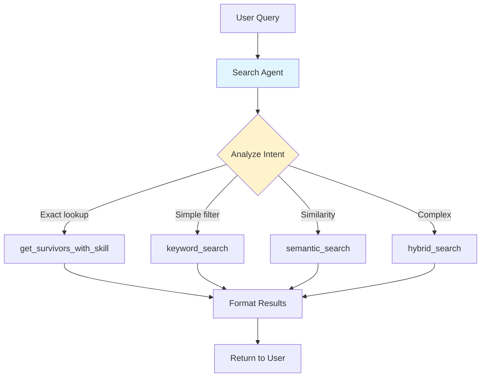
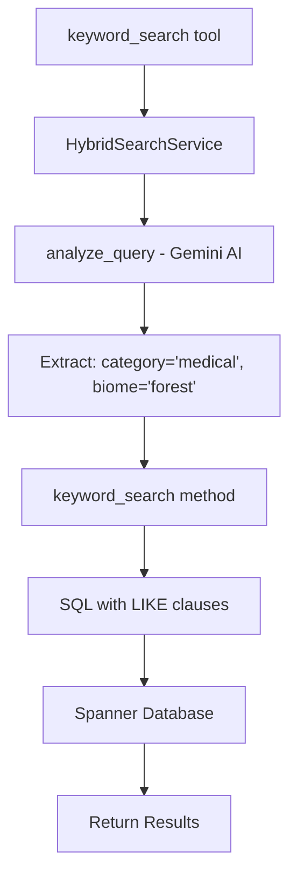
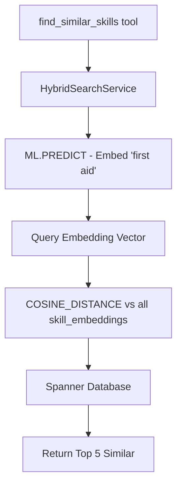
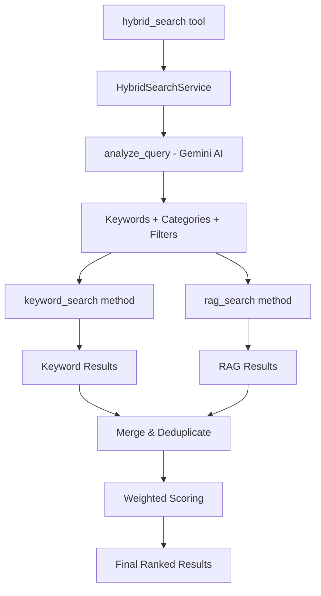

# Part 2: Search Agent - Intelligent Query Routing and Tool Integration

This document explains how the **AI agent** uses the search methods to intelligently answer user queries.

> **Part 1**: See [SEARCH_METHODS.md](file:///Users/qingyue/Documents/2026_workshop/survivor-network-3d/SEARCH_METHODS.md) for technical details on RAG, keyword, and hybrid search.

---

## Table of Contents

1. [Overview](#overview)
2. [Agent Architecture](#agent-architecture)
3. [Tool Definitions](#tool-definitions)
4. [Agent Decision Guide](#agent-decision-guide)
5. [Query Flow Examples](#query-flow-examples)
6. [Code Implementation](#code-implementation)
7. [Performance Optimization](#performance-optimization)

---

## Overview

The **Search Agent** acts as an intelligent router that:
1. Receives natural language queries from users
2. Analyzes query intent and characteristics
3. Selects the optimal search tool
4. Formats and returns results



---

## Agent Architecture

### System Components

**File**: [agent.py](file:///Users/qingyue/Documents/2026_workshop/survivor-network-3d/backend/agent/agent.py#L1-L122)

```
┌─────────────────────────────────────────────────────────────────┐
│                        Agent System                             │
├─────────────────────────────────────────────────────────────────┤
│                                                                 │
│  ┌────────────────────────────────────────────────────────┐    │
│  │  root_agent (Gemini 2.5 Flash)                         │    │
│  │  - Receives user query                                 │    │
│  │  - Analyzes intent                                      │    │
│  │  - Selects best tool                                    │    │
│  └────────────────────────────────────────────────────────┘    │
│                          │                                      │
│                          ▼                                      │
│  ┌────────────────────────────────────────────────────────┐    │
│  │  Search Tools (agent/tools/)                           │    │
│  │  ├── hybrid_search_tools.py                            │    │
│  │  │   ├── hybrid_search()                               │    │
│  │  │   ├── semantic_search()                             │    │
│  │  │   ├── keyword_search()                              │    │
│  │  │   ├── find_similar_skills()                         │    │
│  │  │   └── analyze_query()                               │    │
│  │  │                                                      │    │
│  │  └── survivor_tools.py (legacy)                        │    │
│  │      ├── get_survivors_with_skill()                    │    │
│  │      ├── get_all_survivors()                           │    │
│  │      └── get_urgent_needs()                            │    │
│  └────────────────────────────────────────────────────────┘    │
│                          │                                      │
│                          ▼                                      │
│  ┌────────────────────────────────────────────────────────┐    │
│  │  HybridSearchService                                   │    │
│  │  (backend/services/hybrid_search_service.py)           │    │
│  │  - Executes actual searches                            │    │
│  │  - Queries Spanner database                            │    │
│  └────────────────────────────────────────────────────────┘    │
│                                                                 │
└─────────────────────────────────────────────────────────────────┘
```

### Agent Definition

**File**: [agent.py:L103-121](file:///Users/qingyue/Documents/2026_workshop/survivor-network-3d/backend/agent/agent.py#L103-L121)

```python
root_agent = Agent(
    model="gemini-2.5-flash",
    name="survivor_network_agent",
    instruction=agent_instruction,  # Detailed decision guide
    tools=[
        # Exact match tools (fastest)
        get_survivors_with_skill,
        get_all_survivors,
        get_urgent_needs,
        
        # Hybrid search tools
        hybrid_search,           # Smart auto-routing
        semantic_search,         # Force RAG
        keyword_search,          # Force keywords
        find_similar_skills,     # Skill similarity
        analyze_query,           # Debug tool
    ],
    sub_agents=[multimedia_agent]  # Handles image/video uploads
)
```

---

## Tool Definitions

### 1. Hybrid Search Tools

Located in [hybrid_search_tools.py](file:///Users/qingyue/Documents/2026_workshop/survivor-network-3d/backend/agent/tools/hybrid_search_tools.py)

#### `hybrid_search(query: str, limit: int = 10) -> str`

**Purpose**: Smart search that automatically chooses the best method.

**File**: [hybrid_search_tools.py:L109-143](file:///Users/qingyue/Documents/2026_workshop/survivor-network-3d/backend/agent/tools/hybrid_search_tools.py#L109-L143)

```python
async def hybrid_search(query: str, limit: int = 10) -> str:
    """
    Smart search that automatically chooses the best method.
    
    This tool analyzes your query and decides whether to use:
    - **Keyword Search**: When you have specific terms, filters, or categories
    - **RAG Search**: When you need semantic understanding or similarity
    - **Hybrid**: When both approaches would help
    
    The AI is transparent about which method it chose and why!
    
    Examples:
    - "Find medical skills in forest" → Keyword (has filter)
    - "Find skills similar to first aid" → RAG (needs similarity)
    - "Who can help with healing in mountains" → Hybrid (both)
    """
    service = _get_service()
    result = service.smart_search(query, limit=limit)
    
    return _format_results(
        result["results"],
        result["analysis"],
        show_analysis=True  # Show user the strategy
    )
```

**When Agent Uses**: Complex queries where the best method is unclear.

---

#### `semantic_search(query: str, limit: int = 10) -> str`

**Purpose**: Force RAG/embedding search.

**File**: [hybrid_search_tools.py:L146-181](file:///Users/qingyue/Documents/2026_workshop/survivor-network-3d/backend/agent/tools/hybrid_search_tools.py#L146-L181)

```python
async def semantic_search(query: str, limit: int = 10) -> str:
    """
    Force semantic (RAG) search using embeddings.
    
    Use this when you specifically want to find things by MEANING,
    not just matching keywords. Great for:
    - Finding conceptually similar items
    - Handling vague or abstract queries
    - When exact terms are unknown
    
    Example: "healing abilities" will find "first aid", "surgery", 
    "herbalism" even though no keywords match exactly.
    """
    service = _get_service()
    result = service.smart_search(
        query, 
        force_method=SearchMethod.RAG,  # Skip analysis, go straight to RAG
        limit=limit
    )
    
    return _format_results(result["results"], result["analysis"])
```

**When Agent Uses**: 
- Queries asking for similarity ("find similar to X")
- Conceptual queries ("healing abilities")
- When understanding meaning is critical

---

#### `keyword_search(query: str, limit: int = 10) -> str`

**Purpose**: Force keyword-based search.

**File**: [hybrid_search_tools.py:L184-219](file:///Users/qingyue/Documents/2026_workshop/survivor-network-3d/backend/agent/tools/hybrid_search_tools.py#L184-L219)

```python
async def keyword_search(query: str, limit: int = 10) -> str:
    """
    Force keyword-based search using AI interpretation.
    
    Use this when you want fast, exact matching based on
    specific terms. The AI will extract keywords from your
    query and search for exact matches.
    
    Best for:
    - Specific category searches ("medical skills")
    - Location-filtered searches ("in the forest")  
    - When you know the exact terms
    """
    service = _get_service()
    result = service.smart_search(
        query,
        force_method=SearchMethod.KEYWORD,
        limit=limit
    )
    
    return _format_results(result["results"], result["analysis"])
```

**When Agent Uses**:
- Specific categories ("medical skills", "combat abilities")
- Location filters ("in the forest", "mountain area")
- Speed is critical

---

#### `find_similar_skills(skill_name: str, limit: int = 5) -> str`

**Purpose**: Find skills semantically similar to a given skill.

**File**: [hybrid_search_tools.py:L222-263](file:///Users/qingyue/Documents/2026_workshop/survivor-network-3d/backend/agent/tools/hybrid_search_tools.py#L222-L263)

```python
async def find_similar_skills(skill_name: str, limit: int = 5) -> str:
    """
    Find skills semantically similar to a given skill.
    
    This is a pure RAG use case - it uses embeddings to find
    skills with similar meanings, even if the names are different.
    
    Example:
    - "first aid" → finds "emergency medicine", "triage", "CPR"
    - "hunting" → finds "tracking", "trapping", "archery"
    """
    service = _get_service()
    results = service.find_similar_skills(skill_name, limit)
    
    # Format results nicely
    lines = [f"## 🧬 Skills Similar to '{skill_name}'", ""]
    
    for i, r in enumerate(results, 1):
        similarity_pct = r["similarity"] * 100
        lines.append(f"{i}. **{r['name']}** ({similarity_pct:.1f}% similar)")
        lines.append(f"   Category: {r['category'] or 'Unknown'}")
        lines.append("")
    
    return "\n".join(lines)
```

**When Agent Uses**: 
- Direct similarity questions ("what skills are like X?")
- Exploring related capabilities

---

#### `analyze_query(query: str) -> str`

**Purpose**: Debug tool to show how AI analyzes a query WITHOUT searching.

**File**: [hybrid_search_tools.py:L266-319](file:///Users/qingyue/Documents/2026_workshop/survivor-network-3d/backend/agent/tools/hybrid_search_tools.py#L266-L319)

```python
async def analyze_query(query: str) -> str:
    """
    Show how the AI would analyze a query WITHOUT searching.
    
    Useful for understanding how the hybrid system works and
    debugging unexpected search behavior.
    """
    service = _get_service()
    analysis = service.analyze_query(query)
    
    lines = [
        "## 🔍 Query Analysis",
        "",
        f"**Original Query:** {analysis.original_query}",
        "",
        "### Recommended Strategy",
        f"- **Method:** `{analysis.recommended_method.value}`",
        f"- **Confidence:** {analysis.confidence:.0%}",
        f"- **Reasoning:** {analysis.reasoning}",
        "",
        "### Extracted Information",
        f"- **Keywords:** {analysis.keywords or 'None extracted'}",
        f"- **Categories:** {analysis.categories or 'None detected'}",
        f"- **Biome Filter:** {analysis.biome_filter or 'None'}",
    ]
    
    return "\n".join(lines)
```

**When Agent Uses**: User explicitly asks how a query would be analyzed.

---

### 2. Legacy Exact Match Tools

Located in [survivor_tools.py](file:///Users/qingyue/Documents/2026_workshop/survivor-network-3d/backend/agent/tools/survivor_tools.py)

#### `get_survivors_with_skill(skill_name: str) -> str`

**Purpose**: Find survivors with a specific skill (exact match).

**File**: [survivor_tools.py:L6-58](file:///Users/qingyue/Documents/2026_workshop/survivor-network-3d/backend/agent/tools/survivor_tools.py#L6-L58)

```python
async def get_survivors_with_skill(skill_name: str) -> str:
    """
    Finds survivors who possess a specific skill.
    Fast exact lookup using graph traversal.
    """
    graph_service = GraphService(SpannerService())
    graph_data = await graph_service.get_full_graph()
    
    # Find skill nodes matching name
    target_skill_ids = [
        node.id for node in graph_data.nodes
        if node.type == NodeType.SKILL and skill_name.lower() in node.label.lower()
    ]
    
    # Find survivors connected via HAS_SKILL edges
    survivors = []
    for edge in graph_data.edges:
        if edge.type == EdgeType.HAS_SKILL and edge.target in target_skill_ids:
            survivor_node = next(
                (n for n in graph_data.nodes if n.id == edge.source),
                None
            )
            if survivor_node:
                survivors.append(survivor_node.label)
    
    return f"Survivors with '{skill_name}': {', '.join(survivors)}"
```

**When Agent Uses**: User asks "Who has [exact skill name]?"

---

#### `get_all_survivors() -> str`

**Purpose**: List all survivors and their locations.

**File**: [survivor_tools.py:L60-88](file:///Users/qingyue/Documents/2026_workshop/survivor-network-3d/backend/agent/tools/survivor_tools.py#L60-L88)

```python
async def get_all_survivors() -> str:
    """List all survivors and their locations (biomes)."""
    graph_service = GraphService(SpannerService())
    graph_data = await graph_service.get_full_graph()
    
    survivors_info = [
        f"{node.label} (Location: {node.biome or 'Unknown'})"
        for node in graph_data.nodes
        if node.type == NodeType.SURVIVOR
    ]
    
    return "All Survivors:\n- " + "\n- ".join(survivors_info)
```

**When Agent Uses**: User asks "List all survivors" or "Show me everyone"

---

#### `get_urgent_needs() -> str`

**Purpose**: Find critical/urgent needs in the network.

**File**: [survivor_tools.py:L90-141](file:///Users/qingyue/Documents/2026_workshop/survivor-network-3d/backend/agent/tools/survivor_tools.py#L90-L141)

```python
async def get_urgent_needs() -> str:
    """Finds and lists urgent needs currently affecting survivors."""
    graph_service = GraphService(SpannerService())
    graph_data = await graph_service.get_full_graph()
    
    urgent_needs = []
    
    for edge in graph_data.edges:
        if edge.type == EdgeType.HAS_NEED:
            # Check edge status
            status = edge.properties.get("status", "").lower()
            is_urgent = status in ["critical", "high", "urgent", "active"]
            
            # Also check node urgency property
            if not is_urgent:
                target_node = next(
                    (n for n in graph_data.nodes if n.id == edge.target),
                    None
                )
                if target_node:
                    urgency = str(target_node.properties.get("urgency", "")).lower()
                    is_urgent = urgency in ["high", "critical", "extreme"]
            
            if is_urgent:
                survivor = next((n for n in graph_data.nodes if n.id == edge.source), None)
                need = next((n for n in graph_data.nodes if n.id == edge.target), None)
                if survivor and need:
                    urgent_needs.append(f"{need.label} (Affecting: {survivor.label})")
    
    return "Urgent Needs:\n- " + "\n- ".join(urgent_needs) if urgent_needs else "No urgent needs detected."
```

**When Agent Uses**: User asks "What are the urgent needs?" or "Show me critical issues"

---

## Agent Decision Guide

The agent uses this instruction to select the right tool:

**File**: [agent.py:L15-101](file:///Users/qingyue/Documents/2026_workshop/survivor-network-3d/backend/agent/agent.py#L15-L101)

```python
agent_instruction = """
You are a helpful AI assistant for the Survivor Network application.

## 🎯 DECISION GUIDE (OPTIMIZE FOR SPEED)

You are the router. Analyze the query yourself and pick the specific tool to avoid extra latency.

User Query → Best Tool
────────────────────────────────────────────────────────────────────
EXACT LOOKUPS (fastest)
"List all survivors" → get_all_survivors
"Who has First Aid skill?" → get_survivors_with_skill
"What are urgent needs?" → get_urgent_needs

DIRECT SEARCH (Single Step - FAST)
"Find survivors in forest" → keyword_search (Filter: biome='forest')
"Show me medical skills" → keyword_search (Filter: category='medical')
"Who can fix injuries?" → semantic_search (Concept: fixing injuries)
"Find skills similar to hunting" → find_similar_skills
"Looking for a leader" → keyword_search (Match: category='leadership')

HYBRID (Multi-step - SLOWER)
"Who is good at healing and is in the mountains?" → hybrid_search (Complex: concept + filter)

SEMANTIC/SIMILARITY
"Find skills similar to first aid" → find_similar_skills
"What's related to survival?" → semantic_search
"Skills like hunting" → find_similar_skills

FILTERED/SPECIFIC
"All medical skills" → keyword_search
"Survivors in mountain biome" → keyword_search

DEBUG
"How would you search for X?" → analyze_query


## 📊 UNDERSTANDING RESULTS

Results show:
- 🔤 = Found by keyword matching
- 🧬 = Found by semantic similarity (RAG)
- 🔀 = Found by both methods (most relevant!)

## GUIDELINES
1. **OPTIMIZE LATENCY**: Prefer `keyword_search` or `semantic_search` if the intent is clear.
2. Only use `hybrid_search` for complex queries requiring both filters AND semantic understanding.
3. Show users the search strategy (it's transparent)
4. If results seem off, try `analyze_query` to debug
5. For exact skill names, use `get_survivors_with_skill` (fastest)
"""
```

---

## Query Flow Examples

### Example 1: Simple Exact Lookup

**User Query**: "List all survivors"

**Agent Analysis**:
- This is a simple listing request
- No search needed
- Use fastest tool

**Agent Decision**: `get_all_survivors()`

**Execution**:
```python
# Direct graph traversal, no search
graph_data = await graph_service.get_full_graph()
survivors = [node for node in graph_data.nodes if node.type == NodeType.SURVIVOR]
```

**Speed**: ⚡️ Very fast (~20ms)

---

### Example 2: Keyword Search with Filter

**User Query**: "Find all medical skills in the forest"

**Agent Analysis**:
- Has specific category: "medical"
- Has location filter: "forest"
- No similarity needed
- Use keyword search for speed

**Agent Decision**: `keyword_search("Find all medical skills in the forest")`

**Execution Flow**:


**AI Analysis**:
```json
{
  "recommended_method": "keyword",
  "keywords": ["medical"],
  "categories": ["medical"],
  "biome_filter": "forest",
  "confidence": 0.9
}
```

**Result**:
```markdown
## 🧠 Search Strategy
- Method: `keyword`
- Keywords: medical
- Location Filter: forest

## 📋 Results
1. **Alex** (85% match) 🔤
   📍 Location: Forest
   🛠️ Skills: First Aid, Emergency Medicine
```

**Speed**: ⚡️ Fast (~70ms: 20ms AI analysis + 50ms search)

---

### Example 3: Semantic Search (Similarity)

**User Query**: "Find skills similar to first aid"

**Agent Analysis**:
- Asking for similarity explicitly
- Needs semantic understanding
- Use semantic search

**Agent Decision**: `find_similar_skills("first aid")`

**Execution Flow**:


**SQL Executed**:
```sql
WITH query_embedding AS (
    SELECT embeddings.values AS val
    FROM ML.PREDICT(MODEL TextEmbeddings, (SELECT "first aid" AS content))
)
SELECT name, category,
    COSINE_DISTANCE(skill_embedding, (SELECT val FROM query_embedding)) AS distance
FROM Skills
WHERE skill_embedding IS NOT NULL
ORDER BY distance ASC
LIMIT 5;
```

**Result**:
```markdown
## 🧬 Skills Similar to 'first aid'

1. **Emergency Medicine** (92.3% similar)
   Category: medical

2. **CPR** (88.5% similar)
   Category: medical

3. **Triage** (85.1% similar)
   Category: medical

4. **Field Surgery** (82.4% similar)
   Category: medical

5. **Combat Medic** (78.9% similar)
   Category: combat
```

**Speed**: 🐢 Moderate (~200ms: embedding + similarity calculation)

---

### Example 4: Complex Hybrid Query

**User Query**: "Who can help with healing in the mountains?"

**Agent Analysis**:
- Semantic component: "help with healing" (vague, conceptual)
- Filter component: "in the mountains" (specific location)
- Needs BOTH approaches
- Use hybrid search

**Agent Decision**: `hybrid_search("Who can help with healing in the mountains?")`

**Execution Flow**:


**AI Analysis**:
```json
{
  "recommended_method": "hybrid",
  "keywords": ["help", "healing"],
  "categories": ["medical"],
  "biome_filter": "mountains",
  "needs_similarity_ranking": true,
  "has_specific_filters": true,
  "confidence": 0.85,
  "reasoning": "Query needs semantic understanding for 'healing' AND exact filter for 'mountains'"
}
```

**Keyword Search** finds:
- Survivors with medical category skills
- Survivors in mountain biome

**RAG Search** finds:
- Survivors with skills semantically similar to "healing"
- Ranked by embedding similarity

**Merge Logic**:
```python
# Survivor "Dr. Sarah" found in BOTH
keyword_score = 0.75  # Has medical skills in mountains
rag_score = 0.90      # Skills very similar to "healing"

final_score = 0.4 * 0.75 + 0.6 * 0.90 = 0.84  # High relevance!
method = "HYBRID"
```

**Result**:
```markdown
## 🧠 Search Strategy
- Recommended Method: `hybrid`
- Confidence: 85%
- Keywords: help, healing
- Categories: medical
- Location Filter: mountains

## 📋 Results

1. **Dr. Sarah** (84% match) 🔀
   📍 Location: Mountains
   🛠️ Skills: Surgery, First Aid, Herbalism
   _Found by: both_

2. **Marcus** (72% match) 🧬
   📍 Location: Mountains
   🛠️ Skills: Emergency Medicine
   _Found by: rag_

3. **Chen** (65% match) 🔤
   📍 Location: Mountains
   🛠️ Skills: Medical Research
   _Found by: keyword_

---
_Legend: 🔤 Keyword | 🧬 Semantic (RAG) | 🔀 Hybrid (Both)_
```

**Speed**: 🐌 Slower (~280ms: 30ms analysis + 250ms both searches + merge)

---

### Example 5: Debug Query

**User Query**: "How would you search for 'combat skills near water'?"

**Agent Analysis**:
- User asking about the search process itself
- Not actually searching
- Use analyze tool

**Agent Decision**: `analyze_query("combat skills near water")`

**Result**:
```markdown
## 🔍 Query Analysis

**Original Query:** combat skills near water

### Recommended Strategy
- **Method:** `keyword`
- **Confidence:** 75%
- **Reasoning:** Query has specific category (combat) and location filter (water), keyword search is optimal

### Extracted Information
- **Keywords:** combat, skills, water
- **Categories:** combat
- **Biome Filter:** water
- **Needs Similarity Ranking:** No
- **Has Specific Filters:** Yes

### What This Means
→ Query has specific filters/terms, keyword search is best
```

**Speed**: ⚡️ Fast (~100ms: just analysis, no search)

---

## Code Implementation

### Tool Registration

**File**: [agent.py:L103-121](file:///Users/qingyue/Documents/2026_workshop/survivor-network-3d/backend/agent/agent.py#L103-L121)

```python
root_agent = Agent(
    model="gemini-2.5-flash",
    name="survivor_network_agent",
    instruction=agent_instruction,
    tools=[
        # Order matters for agent decision-making!
        
        # Exact match tools (fastest) - listed first
        get_survivors_with_skill,
        get_all_survivors,
        get_urgent_needs,
        
        # Hybrid search tools - flexible options
        hybrid_search,           # Smart auto-routing
        semantic_search,         # Force RAG
        keyword_search,          # Force keywords
        find_similar_skills,     # Skill similarity
        analyze_query,           # Debug tool
    ],
    sub_agents=[multimedia_agent]
)
```

### Result Formatting

**File**: [hybrid_search_tools.py:L33-106](file:///Users/qingyue/Documents/2026_workshop/survivor-network-3d/backend/agent/tools/hybrid_search_tools.py#L33-L106)

```python
def _format_results(
    results: List[SearchResult],
    analysis: dict,
    show_analysis: bool = True
) -> str:
    """Format search results for display."""
    
    lines = []
    
    # Show search strategy (transparent to user)
    if show_analysis:
        lines.extend([
            "## 🧠 Search Strategy",
            f"**Query Analysis:**",
            f"- Recommended Method: `{analysis['recommended_method']}`",
            f"- Actually Used: `{analysis['actual_method']}`",
            f"- Confidence: {analysis['confidence']:.0%}",
        ])
        
        if analysis['keywords_extracted']:
            lines.append(f"- Keywords: {', '.join(analysis['keywords_extracted'][:5])}")
        
        if analysis['categories']:
            lines.append(f"- Categories: {', '.join(analysis['categories'])}")
            
        if analysis['biome_filter']:
            lines.append(f"- Location Filter: {analysis['biome_filter']}")
        
        if analysis['reasoning']:
            lines.append(f"- Reasoning: _{analysis['reasoning']}_")
        
        lines.extend(["", "---", ""])
    
    lines.append("## 📋 Results")
    lines.append("")
    
    if not results:
        lines.append("No results found. Try rephrasing your query.")
        return "\n".join(lines)
    
    # Format each result
    for i, r in enumerate(results, 1):
        score_pct = r.score * 100
        
        # Method indicator emoji
        method_emoji = {
            SearchMethod.KEYWORD: "🔤",
            SearchMethod.RAG: "🧬",
            SearchMethod.HYBRID: "🔀"
        }.get(r.method, "•")
        
        lines.append(f"{i}. **{r.name}** ({score_pct:.0f}% match) {method_emoji}")
        
        if r.details.get("biome"):
            lines.append(f"   📍 Location: {r.details['biome']}")
        
        # Show matching skills
        skills = r.details.get("matching_skills", [])
        if skills:
            skill_names = [s["name"] if isinstance(s, dict) else s for s in skills[:5]]
            lines.append(f"   🛠️ Skills: {', '.join(skill_names)}")
        
        # Show which method found this
        if r.details.get("found_by"):
            lines.append(f"   _Found by: {r.details['found_by']}_")
        
        lines.append("")
    
    # Legend
    lines.extend([
        "---",
        "_Legend: 🔤 Keyword | 🧬 Semantic (RAG) | 🔀 Hybrid (Both)_"
    ])
    
    return "\n".join(lines)
```

---

## Performance Optimization

### Agent-Level Optimizations

**File**: [agent.py:L51-83](file:///Users/qingyue/Documents/2026_workshop/survivor-network-3d/backend/agent/agent.py#L51-L83)

```python
## 🎯 DECISION GUIDE (OPTIMIZE FOR SPEED)

You are the router. Analyze the query yourself and pick the specific tool to avoid extra latency.

# PREFER THESE (Single tool call)
"Find survivors in forest" → keyword_search
"Who can fix injuries?" → semantic_search
"Find skills similar to hunting" → find_similar_skills

# AVOID UNNECESSARY HYBRID (Multiple tool calls + merge)
"Who is good at healing and is in the mountains?" → hybrid_search
```

### Why This Matters

**Latency Breakdown**:

```
Exact lookup (get_survivors_with_skill):
  Agent decision: ~10ms
  Graph traversal: ~20ms
  ────────────────────────
  TOTAL: ~30ms ⚡️⚡️⚡️

Keyword search:
  Agent decision: ~10ms
  AI query analysis: ~100ms
  SQL execution: ~50ms
  ────────────────────────
  TOTAL: ~160ms ⚡️⚡️

Semantic search (direct):
  Agent decision: ~10ms
  Skip AI analysis: ~0ms (optimized!)
  Embedding + search: ~200ms
  ────────────────────────
  TOTAL: ~210ms ⚡️

Hybrid search:
  Agent decision: ~10ms
  AI query analysis: ~100ms
  Keyword search: ~50ms
  RAG search: ~200ms
  Merge: ~20ms
  ────────────────────────
  TOTAL: ~380ms 🐌
```

### Service-Level Optimization

**File**: [hybrid_search_service.py:L567-583](file:///Users/qingyue/Documents/2026_workshop/survivor-network-3d/backend/services/hybrid_search_service.py#L567-L583)

```python
def smart_search(
    self,
    query: str,
    force_method: Optional[SearchMethod] = None,
    limit: int = 10
):
    # OPTIMIZATION: RAG doesn't need AI analysis
    if force_method == SearchMethod.RAG:
        # Skip expensive Gemini call for query analysis
        # Saves ~100ms!
        analysis = QueryAnalysis(
            original_query=query,
            recommended_method=SearchMethod.RAG,
            keywords=[],  # RAG doesn't use keywords
            categories=[],
            biome_filter=None,
            needs_similarity_ranking=True,
            has_specific_filters=False,
            confidence=1.0,
            reasoning="Forced RAG search (Skipped AI Analysis)"
        )
    else:
        # Keyword/Hybrid need extracted keywords/filters
        analysis = self.analyze_query(query)  # Calls Gemini
    
    # Execute search based on method...
```

**Impact**: When agent selects `semantic_search` directly, saves ~100ms by skipping unnecessary query analysis.

---

## Summary

### Key Points

1. **Agent as Router**: The agent analyzes user intent and selects the optimal tool
2. **Tool Hierarchy**: 
   - Exact lookups (fastest)
   - Direct searches (single method)
   - Hybrid searches (comprehensive but slower)
3. **Transparent to Users**: Results show which method was used and why
4. **Optimized for Speed**: Agent instruction guides toward fastest viable tool

### Decision Tree

```
User Query
    │
    ├─ Exact match? (list all, who has X)
    │   └─→ Use exact lookup tools (30ms)
    │
    ├─ Has specific filters/categories?
    │   └─→ Use keyword_search (160ms)
    │
    ├─ Asks for similarity?
    │   └─→ Use semantic_search or find_similar_skills (210ms)
    │
    └─ Complex (filters + similarity)?
        └─→ Use hybrid_search (380ms)
```

### Agent Intelligence

The agent doesn't just call tools—it:
- ✅ Analyzes query intent
- ✅ Chooses optimal tool for speed
- ✅ Explains decisions to users
- ✅ Falls back to hybrid when uncertain
- ✅ Provides debugging capabilities

---

**Previous**: See [SEARCH_METHODS.md](file:///Users/qingyue/Documents/2026_workshop/survivor-network-3d/SEARCH_METHODS.md) for technical details on how the search methods work!
