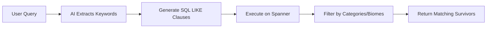
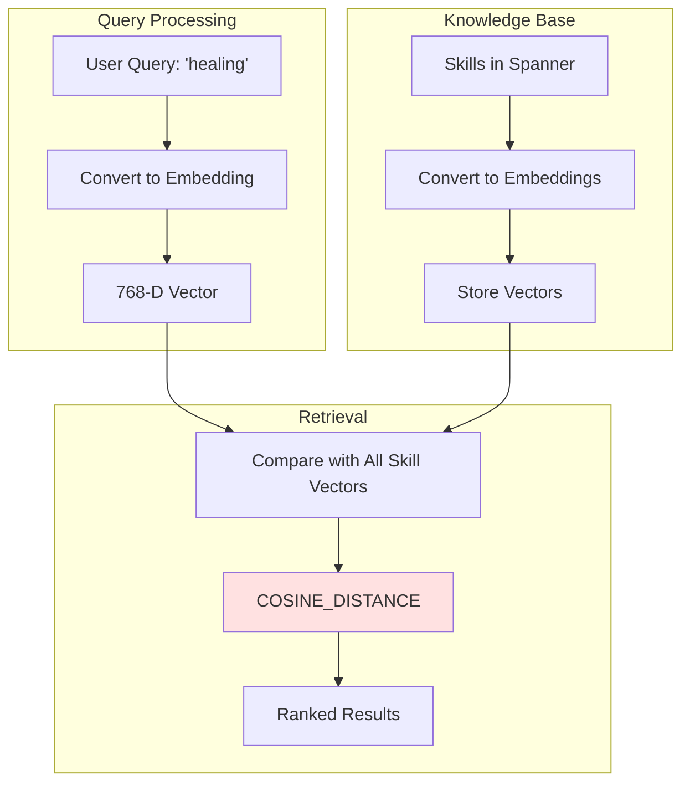
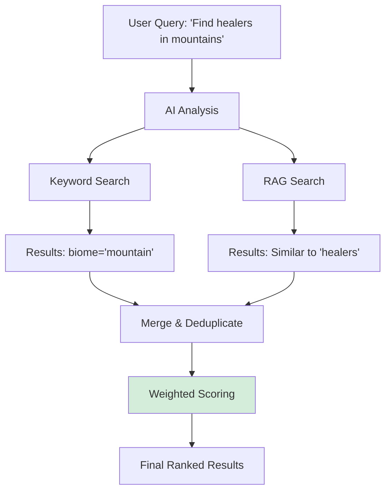
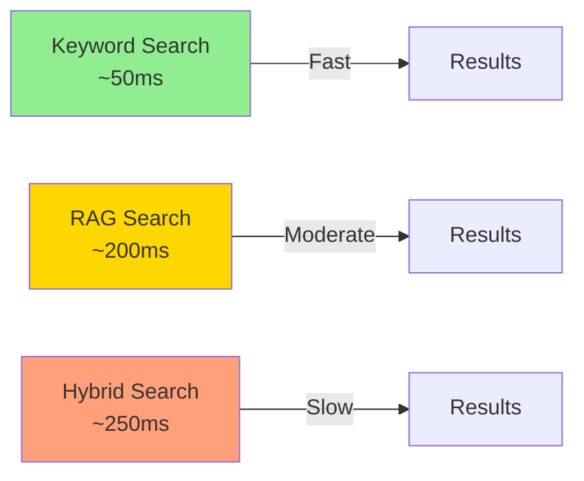

# Part 1: Search Methods - RAG, Keyword, and Hybrid Search

This document explains the **technical foundation** of the three search methods used in Spanner database: Keyword Search, Graph RAG (Semantic Search), and Hybrid Search.

> **Part 2**: See [SEARCH_AGENT.md](file:///Users/qingyue/Documents/2026_workshop/survivor-network-3d/SEARCH_AGENT.md) for how the agent uses these search tools.

---

## Table of Contents

1. [Overview](#overview)
2. [Prerequisites: Spanner Setup](#prerequisites-spanner-setup)
3. [Search Method 1: Keyword Search](#search-method-1-keyword-search)
4. [Search Method 2: Graph RAG (Semantic Search)](#search-method-2-graph-rag-semantic-search)
5. [Search Method 3: Hybrid Search](#search-method-3-hybrid-search)
6. [Database Schema](#database-schema)
7. [ML Models in Spanner](#ml-models-in-spanner)
8. [Performance Comparison](#performance-comparison)

---

## Overview

The Survivor Network uses **Google Cloud Spanner** as a graph database with three complementary search approaches:

| Search Type | Technology | Best For | Speed |
|-------------|-----------|----------|-------|
| **Keyword** | SQL LIKE + AI interpretation | Specific filters, categories, locations | ⚡️ Fast (~50ms) |
| **Graph RAG** | Vector embeddings + Cosine Distance | Semantic similarity, conceptual queries | 🐢 Slower (~200ms) |
| **Hybrid** | Combined approach | Complex queries needing both | 🐌 Slowest (~250ms) |

> [!IMPORTANT]
> All three methods search the **same Spanner database** but use different query strategies.

---

## Prerequisites: Spanner Setup

> [!WARNING]
> Before any search code can work, you **MUST** configure your Spanner database with ML models and embeddings via **Spanner Studio**. This is a **one-time manual setup**.

### Required Configuration

#### 1. Create TextEmbeddings Model

**Purpose**: Converts text into 768-dimensional vector embeddings for semantic search.

**Execute in Spanner Studio**:
```sql
CREATE MODEL TextEmbeddings
INPUT(content STRING(MAX))
OUTPUT(embeddings STRUCT<values ARRAY<FLOAT32>>)
REMOTE OPTIONS (
    endpoint = '//aiplatform.googleapis.com/projects/YOUR_PROJECT_ID/locations/us-central1/publishers/google/models/text-embedding-004'
);
```

Replace `YOUR_PROJECT_ID` with your actual Google Cloud project ID (e.g., `neon-emitter-458622-e3`).

#### 2. Create GeminiPro Model

**Purpose**: Analyzes natural language queries to determine the best search strategy.

**Execute in Spanner Studio**:
```sql
CREATE MODEL GeminiPro
INPUT(prompt STRING(MAX))
OUTPUT(content STRING(MAX))
REMOTE OPTIONS (
    endpoint = '//aiplatform.googleapis.com/projects/YOUR_PROJECT_ID/locations/us-central1/publishers/google/models/gemini-2.5-pro',
    default_batch_size = 1
);
```

#### 3. Add Embeddings Column to Skills Table

**Execute in Spanner Studio**:
```sql
-- Add the column
ALTER TABLE Skills ADD COLUMN skill_embedding ARRAY<FLOAT32>;

-- Populate embeddings for all skills (may take 10-60 seconds)
UPDATE Skills
SET skill_embedding = (
    SELECT embeddings.values
    FROM ML.PREDICT(
        MODEL TextEmbeddings,
        (SELECT name AS content)
    )
)
WHERE skill_embedding IS NULL;
```

### Verification

**Check models exist**:
```sql
SELECT model_name FROM information_schema.models;
```
Expected: `TextEmbeddings` and `GeminiPro`

**Check embeddings populated**:
```sql
SELECT name, ARRAY_LENGTH(skill_embedding) AS dimensions
FROM Skills
WHERE skill_embedding IS NOT NULL
LIMIT 5;
```
Expected: All skills have `dimensions = 768`

**Test semantic search**:
```sql
WITH query_embedding AS (
    SELECT embeddings.values AS val
    FROM ML.PREDICT(MODEL TextEmbeddings, (SELECT "medic" AS content))
)
SELECT name, category,
    COSINE_DISTANCE(skill_embedding, (SELECT val FROM query_embedding)) AS distance
FROM Skills
WHERE skill_embedding IS NOT NULL
ORDER BY distance ASC
LIMIT 5;
```
Expected: Skills semantically similar to "medic" (e.g., "first aid", "surgery")

---

## Search Method 1: Keyword Search

### Theory

Traditional SQL text matching enhanced with AI-powered keyword extraction.



### How It Works

1. **AI Analysis**: Gemini extracts keywords, categories, and filters from natural language
2. **SQL Generation**: Build dynamic SQL with `LIKE` clauses  
3. **Direct Matching**: Search `name`, `category`, and `biome` columns
4. **Fast Execution**: No vector calculations needed

### Code Implementation

**File**: [hybrid_search_service.py:L222-339](file:///Users/qingyue/Documents/2026_workshop/survivor-network-3d/backend/services/hybrid_search_service.py#L222-L339)

```python
def keyword_search(self, analysis: QueryAnalysis, limit: int = 10) -> List[SearchResult]:
    """
    Perform keyword-based search using AI-extracted terms.
    Uses traditional SQL with LIKE clauses - no embeddings needed.
    """
    conditions = []
    params = {}
    param_types_dict = {}
    
    # Build keyword matching conditions
    if analysis.keywords:
        kw_conditions = []
        for i, kw in enumerate(analysis.keywords[:10]):
            param_name = f"kw{i}"
            kw_conditions.append(
                f"(LOWER(sk.name) LIKE @{param_name} OR "
                f"LOWER(sk.category) LIKE @{param_name})"
            )
            params[param_name] = f"%{kw.lower()}%"
            param_types_dict[param_name] = param_types.STRING
        
        if kw_conditions:
            conditions.append(f"({' OR '.join(kw_conditions)})")
    
    # Build category filter
    if analysis.categories:
        cat_conditions = []
        for i, cat in enumerate(analysis.categories):
            param_name = f"cat{i}"
            cat_conditions.append(f"LOWER(sk.category) = @{param_name}")
            params[param_name] = cat.lower()
            param_types_dict[param_name] = param_types.STRING
        
        if cat_conditions:
            conditions.append(f"({' OR '.join(cat_conditions)})")
    
    # Build biome filter
    if analysis.biome_filter:
        conditions.append("LOWER(s.biome) LIKE @biome")
        params["biome"] = f"%{analysis.biome_filter.lower()}%"
        param_types_dict["biome"] = param_types.STRING
    
    where_clause = " AND ".join(conditions) if conditions else "1=1"
    
    # Execute SQL query
    sql = f"""
        SELECT
            s.survivor_id,
            s.name AS survivor_name,
            s.biome,
            sk.skill_id,
            sk.name AS skill_name,
            sk.category
        FROM Survivors s
        JOIN SurvivorHasSkill shs ON s.survivor_id = shs.survivor_id
        JOIN Skills sk ON shs.skill_id = sk.skill_id
        WHERE {where_clause}
        ORDER BY s.name, sk.name
        LIMIT @limit
    """
    
    params["limit"] = limit
    param_types_dict["limit"] = param_types.INT64
    
    # Execute in transaction and group results by survivor
    # ... (grouping logic omitted for brevity)
```

### Example Query

**Input**: "Find all medical skills in the forest"

**AI Extraction**:
```json
{
  "keywords": ["medical"],
  "categories": ["medical"],
  "biome_filter": "forest"
}
```

**Generated SQL**:
```sql
SELECT s.survivor_id, s.name, sk.name AS skill_name
FROM Survivors s
JOIN SurvivorHasSkill shs ON s.survivor_id = shs.survivor_id
JOIN Skills sk ON shs.skill_id = sk.skill_id
WHERE (LOWER(sk.category) = 'medical')
  AND LOWER(s.biome) LIKE '%forest%'
ORDER BY s.name
LIMIT 10
```

### Pros & Cons

✅ **Advantages**:
- Fast execution (~50ms)
- Exact matching with filters
- AI handles natural language interpretation
- Works without embeddings

❌ **Limitations**:
- Cannot understand semantic similarity
- Misses conceptually related items
- Requires exact keyword matches

---

## Search Method 2: Graph RAG (Semantic Search)

### Theory

**RAG (Retrieval-Augmented Generation)** using vector embeddings to find semantically similar content.

### What is RAG?



**RAG Components**:
1. **Retrieval**: Find relevant data using embeddings ← **We use this**
2. **Augmented**: Enhance AI with retrieved context
3. **Generation**: Use LLM to generate answers

In this application, we use the **Retrieval** component for search.

### How Embeddings Work

**Vector Embeddings**: Text converted to high-dimensional vectors representing semantic meaning.

Example:
```
"first aid"  → [0.23, -0.45, 0.89, ..., 0.12]  (768 dimensions)
"surgery"    → [0.25, -0.42, 0.91, ..., 0.15]  (768 dimensions)
"carpentry"  → [-0.65, 0.12, -0.34, ..., 0.78] (768 dimensions)
```

**Cosine Distance**: Measures similarity between vectors.

```
Distance = 1 - (dot_product(A, B) / (||A|| * ||B||))

Values:
  0.0 = Identical meaning
  0.5 = Moderately similar
  1.0+ = Completely different
```

### Code Implementation

**File**: [hybrid_search_service.py:L345-452](file:///Users/qingyue/Documents/2026_workshop/survivor-network-3d/backend/services/hybrid_search_service.py#L345-L452)

```python
def rag_search(self, query: str, limit: int = 10) -> List[SearchResult]:
    """
    Perform semantic search using embeddings.
    Uses Spanner ML.PREDICT with TextEmbeddings model.
    """
    sql = """
        WITH query_embedding AS (
            -- Step 1: Convert query text to embedding vector
            SELECT embeddings.values AS val
            FROM ML.PREDICT(
                MODEL TextEmbeddings,
                (SELECT @query AS content)
            )
        )
        SELECT
            s.survivor_id,
            s.name AS survivor_name,
            s.biome,
            sk.skill_id,
            sk.name AS skill_name,
            sk.category,
            -- Step 2: Calculate similarity between query and each skill
            COSINE_DISTANCE(
                sk.skill_embedding, 
                (SELECT val FROM query_embedding)
            ) AS distance
        FROM Survivors s
        JOIN SurvivorHasSkill shs ON s.survivor_id = shs.survivor_id
        JOIN Skills sk ON shs.skill_id = sk.skill_id
        WHERE sk.skill_embedding IS NOT NULL
        ORDER BY distance ASC  -- Lower distance = more similar
        LIMIT @limit
    """
    
    def run_query(transaction):
        rows = transaction.execute_sql(
            sql,
            params={"query": query, "limit": limit},
            param_types={
                "query": param_types.STRING,
                "limit": param_types.INT64
            }
        )
        
        # Group results by survivor
        # ... (grouping logic)
    
    self.database.run_in_transaction(run_query)
    return results
```

### Example Query

**Input**: "healing abilities"

**Execution**:
```sql
-- Query embedding
ML.PREDICT(TextEmbeddings, "healing abilities") 
→ [0.45, 0.32, -0.12, ...]

-- Find similar skills
COSINE_DISTANCE(skill_embedding, query_embedding)
```

**Results**:
```
skill_name      | category | distance
----------------|----------|----------
First Aid       | medical  | 0.12     ← Very similar
Surgery         | medical  | 0.15
Herbalism       | medical  | 0.21
CPR             | medical  | 0.24
Field Medicine  | medical  | 0.28
```

Note: None of these skills contain the word "healing", but they're semantically related!

### Find Similar Skills (Pure RAG)

**File**: [hybrid_search_service.py:L615-677](file:///Users/qingyue/Documents/2026_workshop/survivor-network-3d/backend/services/hybrid_search_service.py#L615-L677)

```python
def find_similar_skills(self, skill_name: str, limit: int = 10) -> List[Dict]:
    """Find skills semantically similar to a given skill."""
    sql = """
        WITH query_embedding AS (
            SELECT embeddings.values AS val
            FROM ML.PREDICT(
                MODEL TextEmbeddings,
                (SELECT @skill_name AS content)
            )
        )
        SELECT
            sk.skill_id,
            sk.name,
            sk.category,
            COSINE_DISTANCE(
                sk.skill_embedding,
                (SELECT val FROM query_embedding)
            ) AS distance
        FROM Skills sk
        WHERE sk.skill_embedding IS NOT NULL
          AND LOWER(sk.name) != LOWER(@skill_name)  -- Exclude exact match
        ORDER BY distance ASC
        LIMIT @limit
    """
```

**Example**:
```python
find_similar_skills("First Aid", limit=5)

# Results:
# [
#   {"name": "Emergency Medicine", "similarity": 0.92, "category": "medical"},
#   {"name": "CPR", "similarity": 0.88, "category": "medical"},
#   {"name": "Triage", "similarity": 0.85, "category": "medical"},
#   {"name": "Field Surgery", "similarity": 0.82, "category": "medical"},
#   {"name": "Combat Medic", "similarity": 0.78, "category": "combat"}
# ]
```

### Pros & Cons

✅ **Advantages**:
- Understands meaning, not just keywords
- Finds conceptually similar items
- Handles vague/abstract queries
- Language-agnostic similarity

❌ **Limitations**:
- Slower (~200ms with embedding calculation)
- Cannot filter by exact categories
- Requires pre-computed embeddings
- Less predictable than keyword search

---

## Search Method 3: Hybrid Search

### Theory

Combines keyword and RAG for best-of-both-worlds results.



### Merging Strategy

Results from both methods combined using **weighted scoring**:

```python
# Found in BOTH methods (most relevant!)
if found_in_keyword and found_in_rag:
    final_score = 0.4 * keyword_score + 0.6 * rag_score
    method = "HYBRID"

# Found in only RAG
elif found_in_rag:
    final_score = 0.6 * rag_score
    method = "RAG"

# Found in only keyword
else:
    final_score = 0.4 * keyword_score
    method = "KEYWORD"
```

**Why RAG weighted higher (0.6)?**
- RAG captures semantic understanding
- Keyword provides filtering/precision
- RAG score more informative for ranking

### Code Implementation

**File**: [hybrid_search_service.py:L458-539](file:///Users/qingyue/Documents/2026_workshop/survivor-network-3d/backend/services/hybrid_search_service.py#L458-L539)

```python
def hybrid_search(self, query: str, analysis: QueryAnalysis, limit: int = 10) -> List[SearchResult]:
    """
    Run both keyword and RAG search, merge results.
    """
    # Step 1: Execute both searches
    keyword_results = self.keyword_search(analysis, limit=limit)
    rag_results = self.rag_search(query, limit=limit)
    
    # Step 2: Create lookup maps
    keyword_map = {r.id: r for r in keyword_results}
    rag_map = {r.id: r for r in rag_results}
    
    # Step 3: Get all unique survivor IDs
    all_ids = set(keyword_map.keys()) | set(rag_map.keys())
    
    merged_results = []
    
    for surv_id in all_ids:
        kw_result = keyword_map.get(surv_id)
        rag_result = rag_map.get(surv_id)
        
        # Calculate combined score
        kw_score = kw_result.score if kw_result else 0
        rag_score = rag_result.score if rag_result else 0
        
        if kw_result and rag_result:
            # Found in both - very relevant!
            combined_score = 0.4 * kw_score + 0.6 * rag_score
            method = SearchMethod.HYBRID
        elif rag_result:
            combined_score = 0.6 * rag_score
            method = SearchMethod.RAG
        else:
            combined_score = 0.4 * kw_score
            method = SearchMethod.KEYWORD
        
        # Merge skill details from both sources
        base_result = rag_result or kw_result
        merged_details = dict(base_result.details)
        
        if kw_result and rag_result:
            # Combine skill lists, remove duplicates
            kw_skills = {s["id"]: s for s in kw_result.details.get("matching_skills", [])}
            rag_skills = {s["id"]: s for s in rag_result.details.get("matching_skills", [])}
            all_skills = {**kw_skills, **rag_skills}
            merged_details["matching_skills"] = list(all_skills.values())
            merged_details["found_by"] = "both"
        else:
            merged_details["found_by"] = method.value
        
        merged_results.append(SearchResult(
            id=surv_id,
            name=base_result.name,
            type=base_result.type,
            score=combined_score,
            method=method,
            details=merged_details
        ))
    
    # Sort by combined score
    merged_results.sort(key=lambda x: x.score, reverse=True)
    return merged_results[:limit]
```

### Example Query

**Input**: "Who can help with healing in the mountains?"

**Keyword Search** finds:
- Survivors with `category='medical'` skills
- Survivors where `biome LIKE '%mountain%'`

**RAG Search** finds:
- Survivors with skills similar to "healing"
- Ranked by embedding similarity

**Merged Result**:
```
Survivor: Alex
- Keyword score: 0.8 (medical skills in mountains)
- RAG score: 0.9 (skills very similar to "healing")
- Final score: 0.4 * 0.8 + 0.6 * 0.9 = 0.86 ← High relevance!
- Method: HYBRID (found in both)
```

### Pros & Cons

✅ **Advantages**:
- Best of both worlds
- Handles complex multi-criteria queries
- Deduplicates results intelligently
- Items found by both methods ranked highest

❌ **Limitations**:
- Slowest (~250ms, runs both searches)
- More complex logic
- May return fewer results if searches disagree

---

## Database Schema

### Node Tables

**File**: [spanner_graph_service.py:L24-56](file:///Users/qingyue/Documents/2026_workshop/survivor-network-3d/backend/services/spanner_graph_service.py#L24-L56)

```python
self.node_table_config = {
    EntityType.SURVIVOR: {
        'table': 'Survivors',
        'id_column': 'survivor_id',
        'name_column': 'name',
        # Columns: name, biome, status, created_at, etc.
    },
    EntityType.SKILL: {
        'table': 'Skills',
        'id_column': 'skill_id',
        'name_column': 'name',
        # Columns: name, category, description, skill_embedding (ARRAY<FLOAT32>)
    },
    EntityType.NEED: {
        'table': 'Needs',
        'id_column': 'need_id',
        'name_column': 'description',
    },
    # ... other entity types
}
```

### Edge Tables

```python
self.edge_table_config = {
    RelationshipType.HAS_SKILL: {
        'table': 'SurvivorHasSkill',
        'source_col': 'survivor_id',
        'target_col': 'skill_id',
        'property_columns': ['proficiency']
    },
    # ... other relationship types
}
```

### Critical Schema for Search

**Skills Table**:
```sql
CREATE TABLE Skills (
    skill_id STRING(36) NOT NULL,
    name STRING(100),
    category STRING(50),
    description STRING(MAX),
    skill_embedding ARRAY<FLOAT32>,  -- Added for RAG search!
    PRIMARY KEY (skill_id)
);
```

**Survivors Table**:
```sql
CREATE TABLE Survivors (
    survivor_id STRING(36) NOT NULL,
    name STRING(100),
    biome STRING(50),  -- Used for keyword filtering
    status STRING(20),
    created_at TIMESTAMP,
    PRIMARY KEY (survivor_id)
);
```

**SurvivorHasSkill Edge Table**:
```sql
CREATE TABLE SurvivorHasSkill (
    survivor_id STRING(36) NOT NULL,
    skill_id STRING(36) NOT NULL,
    proficiency STRING(20),
    PRIMARY KEY (survivor_id, skill_id),
    FOREIGN KEY (survivor_id) REFERENCES Survivors (survivor_id),
    FOREIGN KEY (skill_id) REFERENCES Skills (skill_id)
);
```

---

## ML Models in Spanner

### 1. TextEmbeddings Model

**Purpose**: Convert text → 768-dimensional vectors

**Model Definition**:
```sql
CREATE MODEL TextEmbeddings
  INPUT(content STRING(MAX))
  OUTPUT(embeddings STRUCT<values ARRAY<FLOAT32>>)
  REMOTE OPTIONS (
    endpoint = '//aiplatform.googleapis.com/projects/[PROJECT]/locations/us-central1/publishers/google/models/text-embedding-004'
  );
```

**Usage**:
```sql
SELECT embeddings.values
FROM ML.PREDICT(
    MODEL TextEmbeddings,
    (SELECT "first aid" AS content)
);
-- Returns: [0.23, -0.45, 0.89, ..., 0.12] (768 floats)
```

**File**: [hybrid_search_service.py:L709-733](file:///Users/qingyue/Documents/2026_workshop/survivor-network-3d/backend/services/hybrid_search_service.py#L709-L733)

### 2. GeminiPro Model

**Purpose**: Analyze queries to determine search strategy

**Model Definition**:
```sql
CREATE MODEL GeminiPro
  INPUT(prompt STRING(MAX))
  OUTPUT(content STRING(MAX))
  REMOTE OPTIONS (
    endpoint = '//aiplatform.googleapis.com/projects/[PROJECT]/locations/us-central1/publishers/google/models/gemini-2.5-pro',
    default_batch_size = 1
  );
```

**Usage**:
```sql
SELECT content
FROM ML.PREDICT(
    MODEL GeminiPro,
    (SELECT "Analyze this query and extract keywords: 'Find medical skills'" AS prompt)
);
-- Returns: JSON with extracted keywords, categories, filters
```

**File**: [hybrid_search_service.py:L109-216](file:///Users/qingyue/Documents/2026_workshop/survivor-network-3d/backend/services/hybrid_search_service.py#L109-L216)

---

## Performance Comparison

### Speed Benchmarks



### When to Use Each Method

#### Use **Keyword Search** when:
- ✅ Query has specific categories ("medical skills", "combat abilities")
- ✅ Query has location filters ("in the forest", "mountain area")
- ✅ Speed is critical
- ✅ Exact matching is desired
- ✅ User knows the precise terms

**Examples**:
- "Find all medical skills"
- "Survivors in the forest biome"
- "Show me combat abilities"

#### Use **RAG Search** when:
- ✅ Query asks for similarity ("skills like X", "similar to Y")
- ✅ Query is conceptual/abstract ("healing abilities", "leadership qualities")
- ✅ Exact terms are unknown
- ✅ Understanding meaning is more important than speed
- ✅ Cross-lingual similarity needed

**Examples**:
- "Find skills similar to first aid"
- "What's related to survival?"
- "Skills like hunting"
- "Healing abilities" (finds "first aid", "surgery", etc.)

#### Use **Hybrid Search** when:
- ✅ Query has both semantic AND filter requirements
- ✅ Maximum relevance is needed
- ✅ Slower response time is acceptable
- ✅ Unsure which method to use (automatic routing)
- ✅ Complex multi-criteria queries

**Examples**:
- "Find someone with healing abilities in the mountains"
- "Who can help with medical emergencies in the forest?"
- "Survivors with combat skills near the river"

### Optimization Tips

1. **Prefer Direct Methods**: Use `keyword_search` or `semantic_search` directly if intent is clear
2. **Skip Analysis for RAG**: When forcing RAG search, skip expensive Gemini query analysis
3. **Cache Embeddings**: Pre-compute and store embeddings (already done in setup)
4. **Limit Results**: Use appropriate `limit` parameter to avoid over-fetching

**Code Optimization** ([hybrid_search_service.py:L567-583](file:///Users/qingyue/Documents/2026_workshop/survivor-network-3d/backend/services/hybrid_search_service.py#L567-L583)):
```python
def smart_search(self, query: str, force_method: Optional[SearchMethod] = None):
    # OPTIMIZATION: RAG doesn't need AI analysis
    if force_method == SearchMethod.RAG:
        # Skip expensive Gemini call (~100ms saved!)
        analysis = QueryAnalysis(
            recommended_method=SearchMethod.RAG,
            keywords=[],  # RAG doesn't use keywords
            reasoning="Forced RAG search (Skipped AI Analysis)"
        )
    else:
        # Keyword/Hybrid need extracted keywords/filters
        analysis = self.analyze_query(query)  # Calls Gemini
```

---

## Summary

### Key Takeaways

1. **Three Complementary Methods**:
   - Keyword: Fast, exact, filter-based
   - RAG: Semantic, similarity-based, intelligent
   - Hybrid: Combined, comprehensive, slower

2. **All Use Spanner**: Same database, different query strategies

3. **Prerequisites Required**: Must set up ML models and embeddings in Spanner Studio first

4. **Performance Trade-offs**:
   - Keyword: Fastest but keyword-limited
   - RAG: Slower but semantically intelligent
   - Hybrid: Slowest but most comprehensive

5. **Choose Wisely**: Pick the right method for the query type

### Architecture Overview

```
┌─────────────────────────────────────────────────────────────────┐
│                   Search System Architecture                    │
├─────────────────────────────────────────────────────────────────┤
│                                                                 │
│  Spanner Database                                               │
│  ├── Tables: Survivors, Skills, SurvivorHasSkill                │
│  ├── ML Models: TextEmbeddings, GeminiPro                       │
│  └── Embeddings: skill_embedding column (768-D vectors)         │
│                                                                 │
│  Search Methods (hybrid_search_service.py)                      │
│  ├── keyword_search(): SQL LIKE + filters                       │
│  ├── rag_search(): ML.PREDICT + COSINE_DISTANCE                 │
│  └── hybrid_search(): Both + weighted merge                     │
│                                                                 │
│  Query Analysis (Gemini AI)                                     │
│  └── analyze_query(): Extract keywords, categories, filters     │
│                                                                 │
└─────────────────────────────────────────────────────────────────┘
```

---

**Next**: See [SEARCH_AGENT.md](file:///Users/qingyue/Documents/2026_workshop/survivor-network-3d/SEARCH_AGENT.md) to learn how the agent intelligently routes queries to these search methods!
