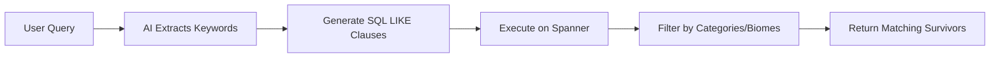
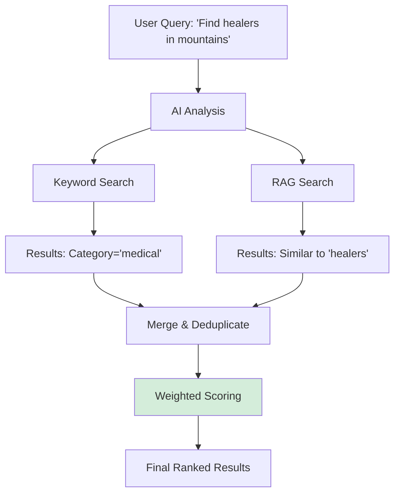
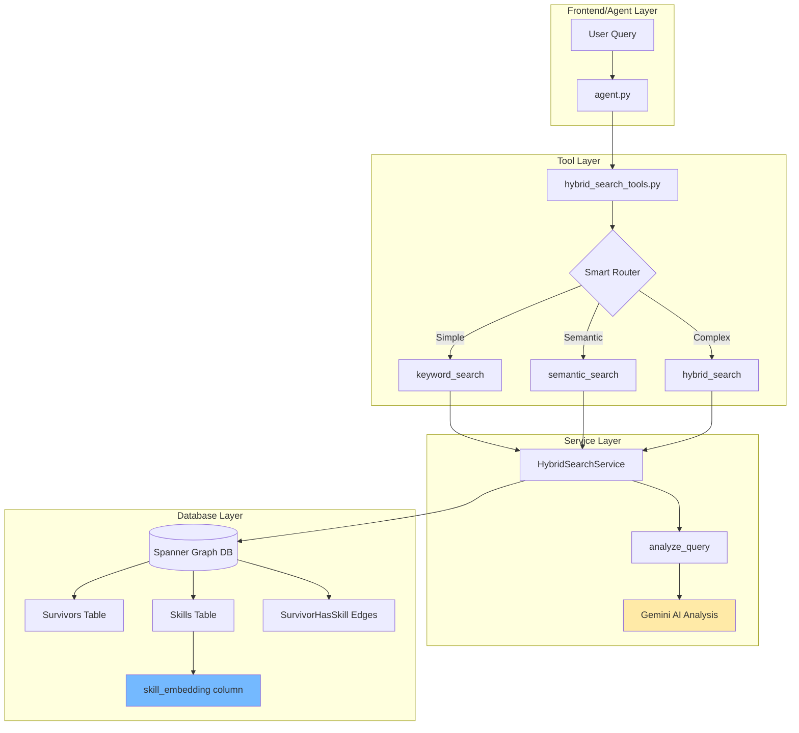
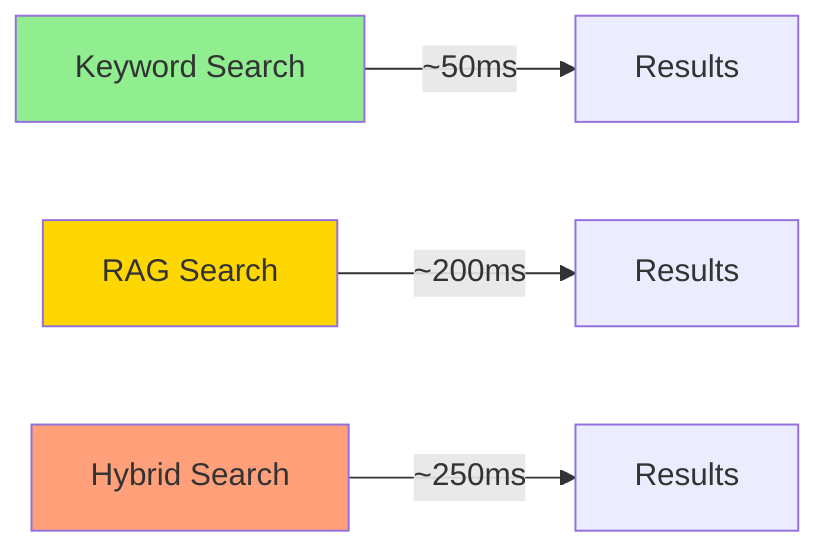

# Comprehensive Search Tutorial: Graph RAG, Keyword Search, and Hybrid Search in Spanner DB

This tutorial explains the different search mechanisms implemented in the Survivor Network 3D application, covering both the theoretical foundation and practical code implementation.

---

## Table of Contents

1. [Overview](#overview)
2. [Search Methods Explained](#search-methods-explained)
   - [Keyword Search](#1-keyword-search)
   - [Graph RAG (Semantic Search)](#2-graph-rag-semantic-search)
   - [Hybrid Search](#3-hybrid-search)
3. [Architecture & Flow](#architecture--flow)
4. [Code Implementation Deep Dive](#code-implementation-deep-dive)
5. [Practical Examples](#practical-examples)
6. [Performance Considerations](#performance-considerations)

---

## Overview

The Survivor Network application uses **Google Cloud Spanner** as a graph database to store and query survivor data. The search system combines three complementary approaches:

| Search Type | Technology | Best For | Speed |
|-------------|-----------|----------|-------|
| **Keyword** | SQL LIKE + AI interpretation | Specific filters, categories, locations | ⚡️ Fast |
| **Graph RAG** | Vector embeddings + Cosine Distance | Semantic similarity, conceptual queries | 🐢 Slower |
| **Hybrid** | Combined approach | Complex queries needing both | 🐌 Slowest |

> [!IMPORTANT]
> All three methods search the **same Spanner database** but use different query strategies to find relevant data.

---

## Search Methods Explained

### 1. Keyword Search

**Theory**: Traditional text-based search using SQL pattern matching enhanced with AI interpretation.

#### How It Works



**Steps**:
1. **AI Analysis**: Gemini model extracts keywords, categories, and filters from natural language
2. **SQL Generation**: Build dynamic SQL with `LIKE` clauses
3. **Direct Matching**: Search `name`, `category`, and `biome` columns
4. **Fast Execution**: No vector calculations needed

#### Code Implementation

**File**: [hybrid_search_service.py](file:///Users/qingyue/Documents/2026_workshop/survivor-network-3d/backend/services/hybrid_search_service.py#L222-L339)

```python
def keyword_search(self, analysis: QueryAnalysis, limit: int = 10) -> List[SearchResult]:
    """
    Perform keyword-based search using AI-extracted terms.
    Uses traditional SQL with LIKE clauses - no embeddings needed.
    """
    conditions = []
    params = {}
    
    # Build keyword conditions
    if analysis.keywords:
        for i, kw in enumerate(analysis.keywords[:10]):
            conditions.append(
                f"(LOWER(sk.name) LIKE @kw{i} OR LOWER(sk.category) LIKE @kw{i})"
            )
            params[f"kw{i}"] = f"%{kw.lower()}%"
    
    # Build category filter
    if analysis.categories:
        for i, cat in enumerate(analysis.categories):
            conditions.append(f"LOWER(sk.category) = @cat{i}")
            params[f"cat{i}"] = cat.lower()
    
    # Build biome filter
    if analysis.biome_filter:
        conditions.append("LOWER(s.biome) LIKE @biome")
        params["biome"] = f"%{analysis.biome_filter.lower()}%"
    
    # Execute SQL query
    sql = f"""
        SELECT s.survivor_id, s.name, s.biome, 
               sk.skill_id, sk.name AS skill_name, sk.category
        FROM Survivors s
        JOIN SurvivorHasSkill shs ON s.survivor_id = shs.survivor_id
        JOIN Skills sk ON shs.skill_id = sk.skill_id
        WHERE {' AND '.join(conditions)}
        ORDER BY s.name
        LIMIT @limit
    """
```

**Key Features**:
- ✅ Fast execution (simple SQL)
- ✅ Exact matching with filters
- ✅ AI handles natural language interpretation
- ❌ Cannot understand semantic similarity

---

### 2. Graph RAG (Semantic Search)

**Theory**: Retrieval-Augmented Generation using vector embeddings to find semantically similar content.

#### What is RAG?

**RAG (Retrieval-Augmented Generation)** combines:
- **Retrieval**: Find relevant data from a knowledge base using embeddings
- **Augmented**: Enhance AI responses with retrieved context
- **Generation**: Use LLM to generate intelligent answers

In this application, we use the **Retrieval** component to search the graph database.

#### How Embeddings Work

```mermaid
graph TB
    A[Text Input: 'first aid'] --> B[TextEmbedding Model]
    B --> C[Vector: [0.23, -0.45, 0.89, ...]]
    C --> D[Compare with Skill Embeddings]
    D --> E[COSINE_DISTANCE Calculation]
    E --> F[Similar Skills Ranked]
    
    style C fill:#e1f5ff
    style E fill:#ffe1e1
```

**Vector Embeddings**: Each skill is converted to a high-dimensional vector (e.g., 768 dimensions) representing its semantic meaning.

**Cosine Distance**: Measures similarity between vectors:
- **0.0** = Identical meaning
- **0.5** = Moderately similar
- **1.0** = Completely different

#### Code Implementation

**File**: [hybrid_search_service.py](file:///Users/qingyue/Documents/2026_workshop/survivor-network-3d/backend/services/hybrid_search_service.py#L345-L452)

```python
def rag_search(self, query: str, limit: int = 10) -> List[SearchResult]:
    """
    Perform semantic search using embeddings.
    Uses Spanner ML.PREDICT with TextEmbeddings model.
    """
    sql = """
        WITH query_embedding AS (
            -- Step 1: Convert query text to embedding vector
            SELECT embeddings.values AS val
            FROM ML.PREDICT(
                MODEL TextEmbeddings,
                (SELECT @query AS content)
            )
        )
        SELECT
            s.survivor_id,
            s.name AS survivor_name,
            s.biome,
            sk.skill_id,
            sk.name AS skill_name,
            sk.category,
            -- Step 2: Calculate similarity between query and each skill
            COSINE_DISTANCE(
                sk.skill_embedding, 
                (SELECT val FROM query_embedding)
            ) AS distance
        FROM Survivors s
        JOIN SurvivorHasSkill shs ON s.survivor_id = shs.survivor_id
        JOIN Skills sk ON shs.skill_id = sk.skill_id
        WHERE sk.skill_embedding IS NOT NULL
        ORDER BY distance ASC  -- Lower distance = more similar
        LIMIT @limit
    """
```

**Key Features**:
- ✅ Understands meaning, not just keywords
- ✅ Finds conceptually similar items
- ✅ Handles vague/abstract queries
- ❌ Slower (requires embedding calculation)
- ❌ Cannot filter by exact categories

**Example**: Query `"healing abilities"` will find:
- ✅ "First Aid" (exact match)
- ✅ "Surgery" (semantically similar)
- ✅ "Herbalism" (related concept)
- Even though none contain the word "healing"!

---

### 3. Hybrid Search

**Theory**: Combines keyword and RAG approaches for best-of-both-worlds results.

#### How It Works



#### Merging Strategy

Results from both methods are combined using weighted scoring:

```python
# If found in BOTH methods
if found_in_keyword and found_in_rag:
    final_score = 0.4 * keyword_score + 0.6 * rag_score
    # RAG weighted higher for semantic understanding
    
# If found in only one
elif found_in_rag:
    final_score = 0.6 * rag_score
else:
    final_score = 0.4 * keyword_score
```

#### Code Implementation

**File**: [hybrid_search_service.py](file:///Users/qingyue/Documents/2026_workshop/survivor-network-3d/backend/services/hybrid_search_service.py#L458-L539)

```python
def hybrid_search(self, query: str, analysis: QueryAnalysis, limit: int = 10) -> List[SearchResult]:
    """
    Run both keyword and RAG search, merge results.
    """
    # Step 1: Execute both searches
    keyword_results = self.keyword_search(analysis, limit=limit)
    rag_results = self.rag_search(query, limit=limit)
    
    # Step 2: Create lookup maps
    keyword_map = {r.id: r for r in keyword_results}
    rag_map = {r.id: r for r in rag_results}
    
    # Step 3: Get all unique survivor IDs
    all_ids = set(keyword_map.keys()) | set(rag_map.keys())
    
    merged_results = []
    
    for surv_id in all_ids:
        kw_result = keyword_map.get(surv_id)
        rag_result = rag_map.get(surv_id)
        
        # Calculate combined score
        if kw_result and rag_result:
            # Found in both - very relevant!
            combined_score = 0.4 * kw_result.score + 0.6 * rag_result.score
            method = SearchMethod.HYBRID
        elif rag_result:
            combined_score = 0.6 * rag_result.score
            method = SearchMethod.RAG
        else:
            combined_score = 0.4 * kw_result.score
            method = SearchMethod.KEYWORD
        
        # Merge skill details from both sources
        merged_results.append(SearchResult(
            id=surv_id,
            name=(rag_result or kw_result).name,
            score=combined_score,
            method=method,
            details=merged_details
        ))
    
    # Sort by combined score
    merged_results.sort(key=lambda x: x.score, reverse=True)
    return merged_results[:limit]
```

**Key Features**:
- ✅ Best of both worlds
- ✅ Handles complex multi-criteria queries
- ✅ Deduplicates results
- ❌ Slowest (runs both searches)

---

## Architecture & Flow

### System Overview



### Query Flow Example

Let's trace a query: **"Find someone who can help with medical emergencies in the forest"**

#### Step 1: Agent Receives Query

**File**: [agent.py](file:///Users/qingyue/Documents/2026_workshop/survivor-network-3d/backend/agent/agent.py#L1-L122)

```python
# Agent instruction guides tool selection
agent_instruction = """
User Query → Best Tool
────────────────────────────────────────
"Who can fix injuries?" → semantic_search (Concept: fixing injuries)
"Show me medical skills" → keyword_search (Filter: category='medical')
"Healers in mountains?" → hybrid_search (Complex: concept + filter)
"""

root_agent = Agent(
    model="gemini-2.5-flash",
    tools=[
        hybrid_search,      # Smart auto-routing
        semantic_search,    # Force RAG
        keyword_search,     # Force keywords
        find_similar_skills # Skill similarity
    ]
)
```

The agent selects `hybrid_search` because the query has:
- **Semantic component**: "help with medical emergencies" (needs RAG)
- **Filter component**: "in the forest" (needs keyword)

#### Step 2: Tool Invoked

**File**: [hybrid_search_tools.py](file:///Users/qingyue/Documents/2026_workshop/survivor-network-3d/backend/agent/tools/hybrid_search_tools.py#L109-L143)

```python
async def hybrid_search(query: str, limit: int = 10) -> str:
    """
    Smart search that automatically chooses the best method.
    Returns formatted results with search strategy explanation.
    """
    service = _get_service()
    result = service.smart_search(query, limit=limit)
    
    return _format_results(
        result["results"],
        result["analysis"],
        show_analysis=True  # Show user the strategy
    )
```

#### Step 3: AI Analysis

**File**: [hybrid_search_service.py](file:///Users/qingyue/Documents/2026_workshop/survivor-network-3d/backend/services/hybrid_search_service.py#L109-L216)

```python
def analyze_query(self, query: str) -> QueryAnalysis:
    """
    Use AI to analyze query and determine optimal search strategy.
    """
    prompt = f"""
    Analyze this query: "{query}"
    
    Available methods:
    1. KEYWORD: AI extracts keywords → SQL LIKE search
    2. RAG: Embed query → Vector similarity search
    3. HYBRID: Run both methods, merge results
    
    Output JSON:
    {{
        "recommended_method": "hybrid",
        "keywords": ["medical", "emergency"],
        "categories": ["medical"],
        "biome_filter": "forest",
        "needs_similarity_ranking": true,
        "has_specific_filters": true,
        "confidence": 0.9,
        "reasoning": "Query needs semantic understanding for 'medical emergencies' 
                     AND exact filter for 'forest' biome"
    }}
    """
    
    result = self._call_gemini(prompt)  # Call Gemini via Spanner ML.PREDICT
    return parse_analysis(result)
```

**Analysis Result**:
```json
{
  "recommended_method": "hybrid",
  "keywords": ["medical", "emergency", "help"],
  "categories": ["medical"],
  "biome_filter": "forest",
  "needs_similarity_ranking": true,
  "has_specific_filters": true,
  "confidence": 0.9,
  "reasoning": "Complex query requiring both semantic understanding and location filter"
}
```

#### Step 4: Execute Searches

**Keyword Search** finds:
- Survivors with skills in "medical" category
- Survivors located in "forest" biome

**RAG Search** finds:
- Survivors with skills semantically similar to "medical emergencies"
- Ranked by embedding similarity

#### Step 5: Merge Results

```python
# Survivor "Alex" found in both searches
keyword_score = 0.8  # Has medical skills in forest
rag_score = 0.9      # Skills very similar to "medical emergencies"

final_score = 0.4 * 0.8 + 0.6 * 0.9 = 0.86  # High relevance!
```

#### Step 6: Return Formatted Results

```markdown
## 🧠 Search Strategy
**Query Analysis:**
- Recommended Method: `hybrid`
- Confidence: 90%
- Keywords: medical, emergency, help
- Location Filter: forest

---

## 📋 Results

1. **Alex** (86% match) 🔀
   📍 Location: Forest
   🛠️ Skills: First Aid, Emergency Medicine, Triage
   _Found by: both_

2. **Sarah** (72% match) 🧬
   📍 Location: Forest
   🛠️ Skills: Herbalism, Natural Medicine
   _Found by: rag_
```

---

## Code Implementation Deep Dive

### Database Schema

The search system relies on this Spanner schema:

**File**: [spanner_graph_service.py](file:///Users/qingyue/Documents/2026_workshop/survivor-network-3d/backend/services/spanner_graph_service.py#L24-L56)

```python
# Node tables
self.node_table_config = {
    EntityType.SURVIVOR: {
        'table': 'Survivors',
        'id_column': 'survivor_id',
        'name_column': 'name',
        # columns: name, biome, status, created_at, etc.
    },
    EntityType.SKILL: {
        'table': 'Skills',
        'id_column': 'skill_id',
        'name_column': 'name',
        # columns: name, category, description, skill_embedding (ARRAY<FLOAT64>)
    }
}

# Edge tables
self.edge_table_config = {
    RelationshipType.HAS_SKILL: {
        'table': 'SurvivorHasSkill',
        'source_col': 'survivor_id',
        'target_col': 'skill_id',
        'property_columns': ['proficiency']
    }
}
```

### ML Models in Spanner

Your Spanner database has two ML models:

**1. TextEmbeddings Model**
```sql
-- Converts text to vector embeddings
CREATE MODEL TextEmbeddings
  INPUT(content STRING)
  OUTPUT(embeddings STRUCT<values ARRAY<FLOAT64>>)
  REMOTE OPTIONS (
    endpoint = 'text-embedding-004'
  );
```

**2. GeminiPro Model**
```sql
-- AI analysis for query interpretation
CREATE MODEL GeminiPro
  INPUT(prompt STRING)
  OUTPUT(content STRING)
  REMOTE OPTIONS (
    endpoint = 'gemini-2.5-pro'
  );
```

### AI Analysis via Gemini

**File**: [hybrid_search_service.py](file:///Users/qingyue/Documents/2026_workshop/survivor-network-3d/backend/services/hybrid_search_service.py#L709-L733)

```python
def _call_gemini(self, prompt: str) -> str:
    """Call Gemini model via Spanner ML.PREDICT."""
    sql = """
        SELECT content
        FROM ML.PREDICT(
            MODEL GeminiPro,
            (SELECT @prompt AS prompt)
        )
    """
    
    # Execute in transaction
    def run_query(transaction):
        rows = transaction.execute_sql(
            sql,
            params={"prompt": prompt},
            param_types={"prompt": param_types.STRING}
        )
        for row in rows:
            return row[0]
    
    return self.database.run_in_transaction(run_query)
```

### Find Similar Skills (Pure RAG)

**File**: [hybrid_search_service.py](file:///Users/qingyue/Documents/2026_workshop/survivor-network-3d/backend/services/hybrid_search_service.py#L615-L677)

This is a **pure RAG use case** - finding skills semantically similar to a given skill:

```python
def find_similar_skills(self, skill_name: str, limit: int = 10) -> List[Dict]:
    """Find skills similar to a given skill."""
    sql = """
        WITH query_embedding AS (
            -- Get embedding for target skill
            SELECT embeddings.values AS val
            FROM ML.PREDICT(
                MODEL TextEmbeddings,
                (SELECT @skill_name AS content)
            )
        )
        SELECT
            sk.skill_id,
            sk.name,
            sk.category,
            COSINE_DISTANCE(
                sk.skill_embedding,
                (SELECT val FROM query_embedding)
            ) AS distance
        FROM Skills sk
        WHERE sk.skill_embedding IS NOT NULL
          AND LOWER(sk.name) != LOWER(@skill_name)  -- Exclude exact match
        ORDER BY distance ASC
        LIMIT @limit
    """
```

**Example Usage**:
```python
results = service.find_similar_skills("First Aid", limit=5)

# Results:
# [
#   {"name": "Emergency Medicine", "similarity": 0.92},
#   {"name": "CPR", "similarity": 0.88},
#   {"name": "Triage", "similarity": 0.85},
#   {"name": "Field Surgery", "similarity": 0.82},
#   {"name": "Combat Medic", "similarity": 0.78}
# ]
```

---

## Practical Examples

### Example 1: Simple Keyword Search

**Query**: "Find all medical skills"

**Agent Decision**: Use `keyword_search` (specific category)

**Execution**:
```python
# AI extracts
analysis = {
    "keywords": ["medical"],
    "categories": ["medical"],
    "biome_filter": None
}

# SQL generated
SELECT s.survivor_id, s.name, sk.name AS skill_name
FROM Survivors s
JOIN SurvivorHasSkill shs ON s.survivor_id = shs.survivor_id
JOIN Skills sk ON shs.skill_id = sk.skill_id
WHERE LOWER(sk.category) = 'medical'
ORDER BY s.name
```

**Results**: Fast, exact category matches

---

### Example 2: Semantic Search

**Query**: "Find skills similar to hunting"

**Agent Decision**: Use `semantic_search` or `find_similar_skills`

**Execution**:
```python
# Generate embedding for "hunting"
hunting_embedding = ML.PREDICT(TextEmbeddings, "hunting")

# Find similar skill embeddings
SELECT sk.name, COSINE_DISTANCE(sk.skill_embedding, hunting_embedding) AS dist
FROM Skills sk
WHERE sk.skill_embedding IS NOT NULL
ORDER BY dist ASC
```

**Results**: Semantically similar skills
- ✅ Tracking (very similar)
- ✅ Trapping (related concept)
- ✅ Archery (hunting weapon)
- ✅ Wildlife Knowledge (conceptually linked)

---

### Example 3: Complex Hybrid Query

**Query**: "Who can help with healing in the mountains?"

**Agent Decision**: Use `hybrid_search` (semantic + filter)

**Execution**:
```python
# Keyword search
WHERE (LOWER(sk.name) LIKE '%heal%' OR LOWER(sk.category) LIKE '%heal%')
  AND LOWER(s.biome) LIKE '%mountain%'

# RAG search
WITH query_embedding AS (...)
SELECT ... WHERE COSINE_DISTANCE(sk.skill_embedding, query_embedding) < 0.5

# Merge with weighted scoring
final_score = 0.4 * keyword_score + 0.6 * rag_score
```

**Results**: Combined relevance
- 🔀 Survivors found by both methods (highest relevance)
- 🧬 Survivors with semantically similar skills
- 🔤 Survivors with exact category matches in mountains

---

## Performance Considerations

### Speed Comparison



### When to Use Each Method

#### Use **Keyword Search** when:
- ✅ Query has specific categories ("medical skills")
- ✅ Query has location filters ("in the forest")
- ✅ Speed is critical
- ✅ Exact matching is desired

#### Use **RAG Search** when:
- ✅ Query asks for similarity ("skills like X")
- ✅ Query is conceptual/abstract ("healing abilities")
- ✅ Exact terms are unknown
- ✅ Understanding meaning is important

#### Use **Hybrid Search** when:
- ✅ Query has both semantic and filter requirements
- ✅ Maximum relevance is needed
- ✅ Slower response time is acceptable
- ✅ Unsure which method to use (automatic routing)

### Optimization Tips

**File**: [agent.py](file:///Users/qingyue/Documents/2026_workshop/survivor-network-3d/backend/agent/agent.py#L19-L83)

```python
# Agent is optimized to choose the fastest method:

## DECISION GUIDE (OPTIMIZE FOR SPEED)

EXACT LOOKUPS (fastest)
"List all survivors" → get_all_survivors
"Who has First Aid skill?" → get_survivors_with_skill

DIRECT SEARCH (Single Step - FAST)
"Find survivors in forest" → keyword_search
"Who can fix injuries?" → semantic_search

HYBRID (Multi-step - SLOWER)
"Who is good at healing and is in the mountains?" → hybrid_search
```

**Optimization in Code**:

**File**: [hybrid_search_service.py](file:///Users/qingyue/Documents/2026_workshop/survivor-network-3d/backend/services/hybrid_search_service.py#L567-L583)

```python
def smart_search(self, query: str, force_method: Optional[SearchMethod] = None):
    # OPTIMIZATION: RAG doesn't need AI analysis
    if force_method == SearchMethod.RAG:
        # Skip expensive Gemini call for query analysis
        analysis = QueryAnalysis(
            recommended_method=SearchMethod.RAG,
            keywords=[],  # RAG doesn't use keywords
            reasoning="Forced RAG search (Skipped AI Analysis)"
        )
    else:
        # Keyword/Hybrid need extracted keywords/filters
        analysis = self.analyze_query(query)  # Call Gemini
```

This optimization **saves ~100ms** when using forced RAG search!

---

## Summary

### Key Takeaways

1. **Three Search Methods**:
   - **Keyword**: Fast, exact matching with AI-extracted terms
   - **RAG**: Semantic similarity using vector embeddings
   - **Hybrid**: Combined approach for complex queries

2. **All Search the Same Database**: Google Cloud Spanner with graph tables

3. **Smart Routing**: AI analyzes queries and automatically selects the best method

4. **Transparent to Users**: Results show which method found each item

5. **Performance Trade-offs**:
   - Keyword: Fastest, but keyword-limited
   - RAG: Slower, but semantically intelligent
   - Hybrid: Slowest, but most comprehensive

### Architecture Summary

```
┌─────────────────────────────────────────────────────────────────┐
│                     Search System Flow                          │
├─────────────────────────────────────────────────────────────────┤
│                                                                 │
│  1. User Query → Agent (agent.py)                               │
│  2. Agent selects tool (hybrid_search_tools.py)                 │
│  3. Tool calls service (hybrid_search_service.py)               │
│  4. Service analyzes query (Gemini AI)                          │
│  5. Execute search method(s):                                   │
│     - Keyword: SQL LIKE on Spanner                              │
│     - RAG: ML.PREDICT + COSINE_DISTANCE on embeddings           │
│     - Hybrid: Both + merge                                      │
│  6. Format and return results                                   │
│                                                                 │
└─────────────────────────────────────────────────────────────────┘
```

### Related Files

- [agent.py](file:///Users/qingyue/Documents/2026_workshop/survivor-network-3d/backend/agent/agent.py) - Agent tool routing
- [hybrid_search_tools.py](file:///Users/qingyue/Documents/2026_workshop/survivor-network-3d/backend/agent/tools/hybrid_search_tools.py) - Search tool definitions
- [hybrid_search_service.py](file:///Users/qingyue/Documents/2026_workshop/survivor-network-3d/backend/services/hybrid_search_service.py) - Core search logic
- [spanner_graph_service.py](file:///Users/qingyue/Documents/2026_workshop/survivor-network-3d/backend/services/spanner_graph_service.py) - Database schema
- [survivor_tools.py](file:///Users/qingyue/Documents/2026_workshop/survivor-network-3d/backend/agent/tools/survivor_tools.py) - Legacy exact-match tools

---

**Questions or need clarification?** This tutorial covers the complete search architecture from theory to implementation!
