# Building an AI-Powered Survivor Network with Graph RAG and Multi-Agent Systems

## Introduction
**Duration: 3 min**

### The Challenge

In disaster response scenarios, coordinating survivors with different skills, resources, and needs across multiple locations requires intelligent data management and search capabilities. This workshop teaches you to build a production AI system that combines:

1. **Graph Database (Spanner)**: Store complex relationships between survivors, skills, and resources
2. **AI-Powered Search**: Semantic + keyword hybrid search using embeddings
3. **Multimodal Processing**: Extract structured data from images, text, and video
4. **Multi-Agent Orchestration**: Coordinate specialized agents for complex workflows
5. **Long-Term Memory**: Personalization with Vertex AI Memory Bank


### What You'll Build

A **Survivor Network Graph Database** with:
- 🗺️ **3D Interactive Graph Visualization** of survivor relationships
- 🔍 **Intelligent Search** (keyword, semantic, and hybrid)
- 📸 **Multimodal Upload Pipeline** (extract entities from images/video)
- 🤖 **Multi-Agent System** for complex task orchestration
- 🧠 **Memory Bank Integration** for personalized interactions

### Core Technologies

| Component | Technology | Purpose |
|-----------|-----------|---------|
| **Database** | Cloud Spanner Graph | Store nodes (survivors, skills) and edges (relationships) |
| **AI Search** | Gemini + Embeddings | Semantic understanding + similarity search |
| **Agent Framework** | ADK (Agent Development Kit) | Orchestrate AI workflows |
| **Memory** | Vertex AI Memory Bank | Long-term user preference storage |
| **Frontend** | React + Three.js | Interactive 3D graph visualization |

---

## Set Up
**Duration: 5 min**

### Clone Repository and Initialize

👉💻 Clone the project:

```bash
git clone https://github.com/cuppibla/survivor-network-3d.git
cd survivor-network-3d/
```

👉💻 Make the init script executable and run it:

```bash
chmod +x init.sh
./init.sh
```

> aside positive
> The script will prompt you to create a new Google Cloud Project. You can accept the default randomly generated Project ID or specify your own.

### Configure Project

👉💻 Set your project ID:

```bash
gcloud config set project $(cat ~/project_id.txt) --quiet
```

👉💻 Enable required APIs (this takes ~2-3 minutes):

```bash
gcloud services enable compute.googleapis.com \
                       aiplatform.googleapis.com \
                       run.googleapis.com \
                       cloudbuild.googleapis.com \
                       artifactregistry.googleapis.com \
                       spanner.googleapis.com \
                       storage.googleapis.com
```

### Run Setup Script

👉💻 Execute the setup script:

```bash
./setup.sh
```

This creates:
- Spanner instance (`survivor-network`)
- Database (`graph-db`)
- All node and edge tables
- Property graphs for querying

### Load Sample Data

👉💻 Navigate to backend and install dependencies:

```bash
cd ~/survivor-network-3d/backend
uv sync
```

👉💻 Load initial survivor data:

```bash
uv run python ~/survivor-network-3d/backend/setup_data.py
```

**Expected output**:
```
✅ Created 4 survivors
✅ Created 12 skills
✅ Created 8 resources
✅ Created 4 biomes
✅ Created 15 relationships
```

---

## AI in Spanner Studio
**Duration: 8 min**

### Navigate to Spanner Studio

1. Open [Google Cloud Console](https://console.cloud.google.com)
2. Select your project from the dropdown
3. Search for "Spanner" in the search bar
4. Click on your instance: `survivor-network`
5. Click **"Spanner Studio"** in the left sidebar

### Create Embedding Model

Spanner can call Vertex AI models directly using `ML.PREDICT`.

👉 In Spanner Studio, run this SQL (replace `YOUR_PROJECT_ID`):

```sql
CREATE MODEL TextEmbeddings
INPUT(content STRING(MAX))
OUTPUT(embeddings STRUCT<values ARRAY<FLOAT32>>)
REMOTE OPTIONS (
    endpoint = '//aiplatform.googleapis.com/projects/YOUR_PROJECT_ID/locations/us-central1/publishers/google/models/text-embedding-004'
);
```

> aside positive
> This creates a "virtual model" that references Vertex AI's text-embedding-004. No data leaves Spanner—it's called via API.

### Add Embedding Column

👉 Add a column to store embeddings:

```sql
ALTER TABLE Skills ADD COLUMN skill_embedding ARRAY<FLOAT32>;
```

### Generate Embeddings

👉 Use AI to create vector embeddings for each skill:

```sql
UPDATE Skills
SET skill_embedding = (
    SELECT embeddings.values
    FROM ML.PREDICT(
        MODEL TextEmbeddings,
        (SELECT name AS content)
    )
)
WHERE skill_embedding IS NULL;
```

**What happens**: Each skill name (e.g., "first aid") is converted to a 768-dimension vector representing its semantic meaning.

### Verify Embeddings

👉 Check that embeddings were created:

```sql
SELECT 
    skill_id,
    name,
    ARRAY_LENGTH(skill_embedding) AS embedding_dimensions
FROM Skills
LIMIT 5;
```

**Expected output**:
```
skill_id  | name       | embedding_dimensions
----------|------------|--------------------
sk_001    | first aid  | 768
sk_002    | hunting    | 768
sk_003    | cooking    | 768
```

### Test Semantic Search

👉 Find skills similar to "medic":

```sql
WITH query_embedding AS (
    SELECT embeddings.values AS val
    FROM ML.PREDICT(MODEL TextEmbeddings, (SELECT "medic" AS content))
)
SELECT
    s.name AS skill_name,
    s.category,
    COSINE_DISTANCE(s.skill_embedding, (SELECT val FROM query_embedding)) AS distance
FROM Skills AS s
WHERE s.skill_embedding IS NOT NULL
ORDER BY distance ASC
LIMIT 10;
```

**Expected results** (lower distance = more similar):
```
skill_name       | category  | distance
-----------------|-----------|----------
first aid        | medical   | 0.123  ← Most similar
surgery          | medical   | 0.156
triage           | medical   | 0.189
herbalism        | medical   | 0.245
hunting          | survival  | 0.723  ← Less similar
```

### Create Gemini Model for Analysis

👉 Create a generative AI model reference:

```sql
CREATE MODEL GeminiPro
INPUT(prompt STRING(MAX))
OUTPUT(content STRING(MAX))
REMOTE OPTIONS (
    endpoint = '//aiplatform.googleapis.com/projects/YOUR_PROJECT_ID/locations/us-central1/publishers/google/models/gemini-2.5-pro',
    default_batch_size = 1
);
```

### Use Gemini for Compatibility Analysis

👉 Analyze survivor pairs for mission compatibility:

```sql
WITH PairData AS (
    SELECT
        s1.name AS Name_A,
        s2.name AS Name_B,
        CONCAT(
            "Assess compatibility of these two survivors for a resource-gathering mission. ",
            "Survivor 1: ", s1.name, ". ",
            "Survivor 2: ", s2.name, ". ",
            "Give a score from 1-10 and a 1-sentence reason."
        ) AS prompt
    FROM Survivors s1
    JOIN Survivors s2 ON s1.survivor_id < s2.survivor_id
    LIMIT 1
)
SELECT
    p.Name_A,
    p.Name_B,
    ml.content AS ai_assessment
FROM PairData p,
     ML.PREDICT(MODEL GeminiPro, (SELECT p.prompt AS prompt)) AS ml;
```

**Example output**:
```
Name_A    | Name_B | ai_assessment
----------|--------|----------------
Dr. Chen  | Park   | Score: 8/10. Dr. Chen's medical expertise combined with Park's survival skills makes them an excellent team for resource gathering in potentially dangerous environments.
```

---

## Hybrid Search System
**Duration: 10 min**

### Understanding Search Methods

The application implements three search approaches:

| Method | Best For | How It Works |
|--------|----------|--------------|
| **Keyword** | Specific terms, categories, filters | Exact SQL matching on names/categories |
| **Semantic (RAG)** | Conceptual queries, similarity | Vector embedding cosine similarity |
| **Hybrid** | Complex queries needing both | Combines keyword + semantic, ranks results |


### Start the Application

👉💻 Start backend (in one terminal):

```bash
cd ~/survivor-network-3d/backend
uv run uvicorn main:app
```

👉💻 Open a **new terminal** and start frontend:

```bash
gcloud config set project $(cat ~/project_id.txt) --quiet
cd ~/survivor-network-3d/frontend
npm install
npm run dev
```

👉 Click "Web Preview" → "Preview on port 5173"

### Test Keyword Search

In the chat interface, try:

**Query 1**: "Find all medical skills"

**What happens**:
- Agent detects category filter: `medical`
- Uses keyword search (fast SQL query)
- Returns all skills with `category='medical'`

**Query 2**: "Show survivors in the forest"

**What happens**:
- Agent detects biome filter: `forest`
- Uses keyword search with `biome='forest'`

### Test Semantic Search

**Query 3**: "Find skills similar to healing"

**What happens**:
- Agent recognizes similarity request
- Generates embedding for "healing"
- Uses cosine distance to find semantically similar skills
- Returns: first aid, surgery, herbalism (even though names don't match "healing")

**Query 4**: "Who can help with injuries?"

**What happens**:
- "injuries" is a concept, not an exact skill name
- Semantic search finds related medical skills
- Agent identifies survivors with those skills

### Test Hybrid Search

**Query 5**: "Find medical skills in the mountains"

**What happens**:
1. **Keyword component**: Filter for `category='medical'` AND `biome='mountains'`
2. **Semantic component**: Embed "medical" and rank by similarity
3. **Merge**: Combine results, prioritizing those found by both methods 🔀

**Query 6**: "Who is good at survival and in the forest?"

**What happens**:
- Keyword finds: `biome='forest'`
- Semantic finds: skills similar to "survival"
- Hybrid combines both for best results

---

## Multimodal Data Pipeline
**Duration: 8 min**

### Architecture

```mermaid
graph LR
    A[📁 Media File] --> B[☁️ Upload to GCS]
    B --> C[🔍 AI Extraction]
    C --> D[💾 Save to Spanner]
    D --> E[🗺️ Graph Network]
```



The pipeline supports:
- 📸 **Images**: Gemini Vision extracts survivors, resources, locations
- 📄 **Text**: NLP extraction from field reports
- 🎥 **Video**: Frame-by-frame + audio transcription

### Test Image Upload

👉 In the chat interface, type:

```
Upload this image: /path/to/your/image.jpg
```

**What happens behind the scenes**:

1. **UploadAgent**: 
   - Uploads file to Google Cloud Storage
   - Detects media type (image/text/video)
   - Generates signed URL for access

2. **ExtractionAgent**:
   - Downloads image from GCS
   - Sends to Gemini Vision with extraction prompt
   - AI analyzes image for:
     - Survivors (names, conditions, roles)
     - Resources (medical supplies, tools)
     - Locations (biomes, coordinates)
     - Relationships (who has what, who is where)

3. **SpannerAgent**:
   - Creates new entity nodes in Spanner
   - Creates relationship edges
   - Creates broadcast record with thumbnail

4. **SummaryAgent**:
   - Synthesizes user-friendly summary
   - Returns structured report

### Example Extraction Result

For an image of "Dr. Elena Frost in blue gear with medical supplies in an icy landscape":

```json
{
  "entities": [
    {
      "entity_type": "Survivor",
      "name": "Dr. Elena Frost",
      "properties": {
        "role": "Xenobiologist",
        "condition": "good",
        "description": "Blue gear, medical scanner"
      },
      "confidence": 0.95
    },
    {
      "entity_type": "Resource",
      "name": "Medical Supplies",
      "properties": {
        "type": "Medical",
        "condition": "good"
      },
      "confidence": 0.9
    },
    {
      "entity_type": "Biome",
      "name": "Cryo Zone",
      "properties": {
        "description": "Icy landscape"
      },
      "confidence": 1.0
    }
  ],
  "relationships": [
    {
      "type": "SurvivorFoundResource",
      "source": "Dr. Elena Frost",
      "target": "Medical Supplies"
    },
    {
      "type": "SurvivorInBiome",
      "source": "Dr. Elena Frost",
      "target": "Cryo Zone"
    }
  ]
}
```

### View Extraction in Spanner

👉 In Spanner Studio, query the new data:

```sql
SELECT s.name, r.name AS resource, b.name AS location
FROM Survivors s
JOIN SurvivorFoundResource sfr ON s.survivor_id = sfr.survivor_id
JOIN Resources r ON sfr.resource_id = r.resource_id
JOIN SurvivorInBiome sib ON s.survivor_id = sib.survivor_id
JOIN Biomes b ON sib.biome_id = b.biome_id
WHERE s.name = 'Dr. Elena Frost';
```

---

## Multi-Agent System
**Duration: 7 min**

### Sequential Agent Pattern

The multimodal pipeline uses **SequentialAgent** to coordinate 4 specialized agents:

```python
# backend/agent/multimedia_agent.py
multimedia_agent = SequentialAgent(
    name="MultimediaExtractionPipeline",
    description="Upload → Extract → Save → Summarize",
    sub_agents=[
        upload_agent,       # Stage 1: Upload to GCS
        extraction_agent,   # Stage 2: AI extraction
        spanner_agent,      # Stage 3: Save to database
        summary_agent       # Stage 4: User summary
    ]
)
```

### Data Flow Between Agents

Each agent stores its output in a shared **context** that subsequent agents can access:


### Agent Instructions with Context

Agents use `{key}` syntax to access previous results:

```python
extraction_agent = LlmAgent(
    name="ExtractionAgent",
    instruction="""
    Extract information from uploaded media.
    
    Previous step result: {upload_result}
    
    Use extract_from_media(gcs_uri, media_type, signed_url)
    with values from the upload result.
    """,
    tools=[extract_from_media],
    output_key="extraction_result"
)
```

**At runtime**, ADK replaces `{upload_result}` with actual data:

```
Previous step result: {
    "gcs_uri": "gs://bucket/uploads/image.jpg",
    "media_type": "image",
    "signed_url": "https://..."
}
```

### Why Multi-Agent?

**Benefits**:
- ✅ **Separation of Concerns**: Each agent has one clear job
- ✅ **Easier Testing**: Test agents independently
- ✅ **Better Error Handling**: Failures isolated to specific stages  
- ✅ **Reusability**: Agents can be composed in different pipelines
- ✅ **Clear Data Flow**: Explicit inputs/outputs

**vs. Monolithic Agent**:
- ❌ One giant agent trying to do everything
- ❌ Complex, hard-to-debug logic
- ❌ Difficult to modify or extend

---

## Deploy with Agent Engine and Cloud Run
**Duration: 10 min**

### Create Agent Engine

Agent Engine provides managed infrastructure for your agents, including:
- Memory Bank storage
- Session management  
- API endpoints

👉💻 Deploy the agent engine:

```bash
cd ~/survivor-network-3d/backend
python deploy_agent.py
```

**What this creates**:
- Agent Engine instance in Vertex AI
- Memory Bank with custom topics (survivor preferences, context)
- Vector database for memory storage

👉 Verify in [Vertex AI Console](https://console.cloud.google.com/vertex-ai/agents/agent-engines)

### Build Container Image

👉💻 Build and push the Docker image:

```bash
cd ~/survivor-network-3d
gcloud builds submit --tag gcr.io/$(gcloud config get-value project)/survivor-network-backend
```

### Deploy to Cloud Run

👉💻 Deploy the backend:

```bash
gcloud run deploy survivor-network-api \
  --image gcr.io/$(gcloud config get-value project)/survivor-network-backend \
  --platform managed \
  --region us-central1 \
  --allow-unauthenticated \
  --set-env-vars="USE_MEMORY_BANK=true,AGENT_ENGINE_ID=<your-agent-engine-id>"
```

Replace `<your-agent-engine-id>` with the ID from the deploy output.

### Deploy Frontend

👉💻 Build the frontend:

```bash
cd ~/survivor-network-3d/frontend
npm run build
```

👉💻 Deploy to Firebase Hosting (or Cloud Run):

```bash
firebase deploy --only hosting
```

---

## Memory Bank Integration
**Duration: 5 min**

### How Memory Works


| Service | Type | Storage | Use Case |
|---------|------|---------|----------|
| **Session Service** | Short-term | Conversation log | "What did I just ask?" |
| **Memory Bank** | Long-term | Synthesized facts | "User prefers medical skills" |

### Memory Topics

Custom topics define what to remember:

```python
# backend/deploy_agent.py
custom_topics = [
    MemoryTopic(
        custom_memory_topic=CustomMemoryTopic(
            label="survivor_preferences",
            description="""Extract user preferences for:
            - Preferred survivor types (medical, combat, survival)
            - Skill categories of interest
            - Biome/location preferences
            """
        )
    ),
    MemoryTopic(
        custom_memory_topic=CustomMemoryTopic(
            label="mission_context",
            description="""Extract mission-related context:
            - Types of missions user plans
            - Required skills for missions
            - Resource priorities
            """
        )
    )
]
```

### Test Memory

👉 In the chat interface, say:

```
I'm planning a medical rescue mission in the mountains. 
I need survivors with first aid and climbing skills.
```

👉 Wait 30 seconds for memory to process (happens in background)

👉 Start a **new session** (refresh page) and ask:

```
What kind of missions am I interested in?
```

**Expected response**:
```
Based on your previous conversations, you're interested in:
- Medical rescue missions
- Mountain/high-altitude operations
- Skills needed: first aid, climbing

Would you like me to find survivors matching these criteria?
```

### View Memories in Console

👉 Go to [Vertex AI Agent Engine](https://console.cloud.google.com/vertex-ai/agents/agent-engines)

👉 Click your agent engine → **Memories** tab

You'll see extracted memories like:
```
Topic: survivor_preferences
Memory: User is planning medical rescue missions in mountainous regions
Source: Session abc123, 2026-01-22
```

###Memory vs. Session

**Without Memory Bank**:
```
User: "I like medical skills"
[New session]
User: "Find me some survivors"
Agent: "What type of survivors?" ← Forgot preference
```

**With Memory Bank**:
```
User: "I like medical skills"
[New session]
User: "Find me some survivors"
Agent: "Based on your preferences, here are medical survivors..." ← Remembers!
```

---

## Conclusion
**Duration: 2 min**

### What You've Built

✅ **Graph Database**: Spanner with nodes (survivors, skills) and edges (relationships)  
✅ **AI Search**: Keyword, semantic, and hybrid search with embeddings  
✅ **Multimodal Pipeline**: Extract entities from images/video with Gemini  
✅ **Multi-Agent System**: Coordinated workflow with ADK  
✅ **Memory Bank**: Long-term personalization with Vertex AI  
✅ **Production Deployment**: Cloud Run + Agent Engine

### Architecture Summary

```
┌─────────────────────────────────────────────────────────┐
│                    Frontend (React)                      │
│            3D Visualization + Chat Interface             │
└────────────────────┬────────────────────────────────────┘
                     │
┌────────────────────▼────────────────────────────────────┐
│              ADK Multi-Agent System                      │
│  ┌──────────┐  ┌──────────┐  ┌──────────┐             │
│  │ Search   │  │Multimodal│  │ Memory   │             │
│  │ Agent    │  │ Pipeline │  │ Agent    │             │
│  └──────────┘  └──────────┘  └──────────┘             │
└────────┬────────────────┬──────────────────┬───────────┘
         │                │                   │
┌────────▼────┐  ┌────────▼───────┐  ┌──────▼──────────┐
│   Spanner   │  │  Cloud Storage  │  │  Memory Bank    │
│   Graph DB  │  │   (GCS)         │  │  (Vertex AI)    │
└─────────────┘  └─────────────────┘  └─────────────────┘
```

### Key Learnings

1. **Graph RAG**: Combines graph database structure with semantic embeddings for intelligent search
2. **Multi-Agent Patterns**: Sequential pipelines for complex, multi-step workflows
3. **Multimodal AI**: Extract structured data from unstructured media (images/video)
4. **Stateful Agents**: Memory Bank enables personalization across sessions

### Next Steps

- **Extend the Graph**: Add more entity types (missions, events, communication logs)
- **Advanced Search**: Implement graph traversal queries (find shortest path between survivors)
- **Real-time Updates**: Add WebSocket support for live graph changes
- **Custom Agents**: Build specialized agents for mission planning, resource allocation

### Resources

- [ADK Documentation](https://cloud.google.com/vertex-ai/generative-ai/docs/agent-builder/adk/overview)
- [Spanner Graph](https://cloud.google.com/spanner/docs/graph/overview)
- [Memory Bank Guide](https://cloud.google.com/vertex-ai/generative-ai/docs/agent-builder/memory-bank)
- [GitHub Repository](https://github.com/cuppibla/survivor-network-3d)

> aside positive
> **Congratulations!** You've built a production-grade AI agent system with graph database, RAG search, multimodal processing, and long-term memory. These patterns apply to any domain requiring intelligent data coordination—from logistics to healthcare to customer service.
